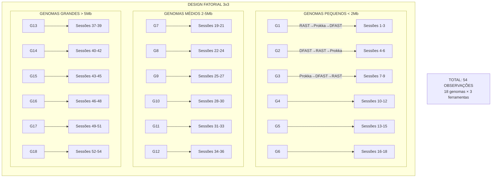
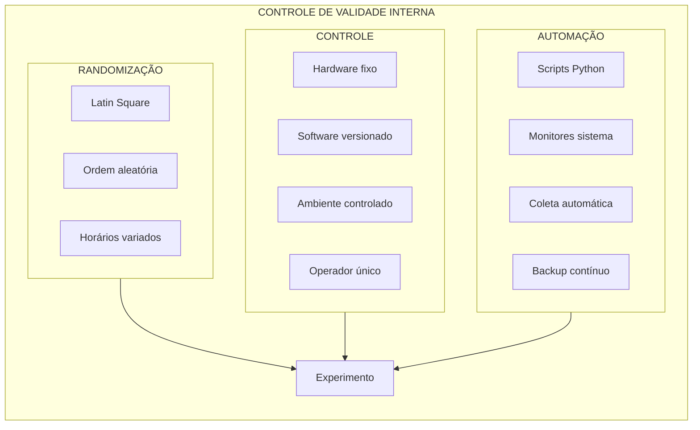
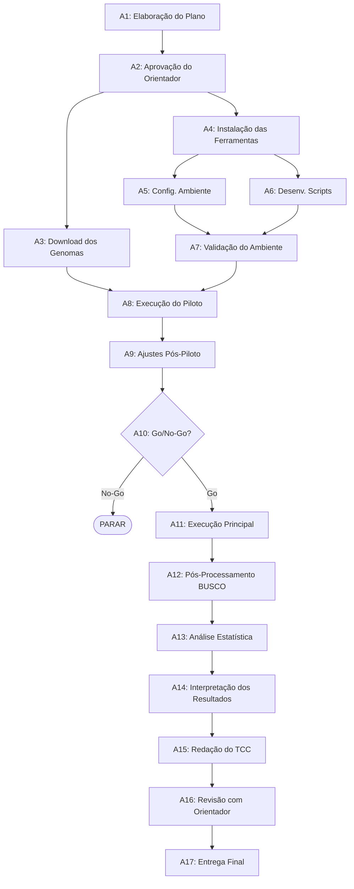
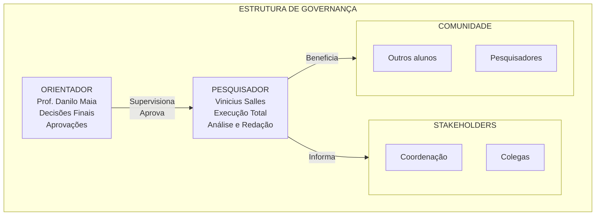
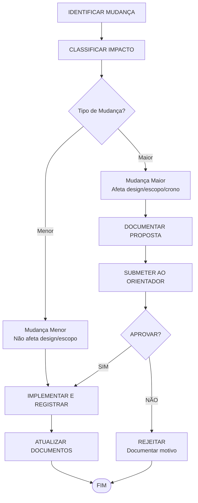

# Proposta-de-Experimento-para-TCC

## 1. Identificação básica


### 1.1 Título do experimento

Análise Comparativa de Performance e Qualidade de Software: Anotadores Genômicos Web-based versus Desktop em Genomas Bacterianos

---

### 1.2 ID / código

EXP-TCC-ANNOT-2025-005

---

### 1.3 Versão do documento e histórico de revisão

- **v1.0** (21/11/2025): Criação inicial do documento com identificação básica e contexto
- **v2.0** (22/11/2025): Definiçao de Escopo, Objetivo
- **v2.5** (23/11/2025): Definiçao de Stakeholders/Impacto, Riscos de alto nível, premissas e critérios de sucesso
- **v3.0** (28/11/2025): Modelo conceitual e hipóteses; Variáveis, fatores, tratamentos e objetos de estudo; Desenho experimental
- **v4.0** (02/12/2025): População, sujeitos e amostragem; Instrumentação e protocolo operacional; Plano de análise de dados (pré-execução)
- **v5.0** (08/12/2025): Plano de comunicação e Critérios de prontidão para execução (Definition of Ready)

---
    
### 1.4 Datas (criação, última atualização)

- **Data de criação:** 21/11/2025
    
- **Última atualização:** 08/12/2025
    
---

### 1.5 Autores (nome, área, contato)

- **Autor principal:** Vinicius Salles de Oliveira - Graduando em Engenharia de Software - [vinicius.oliveira.1444802@sga.pucminas.br](mailto:vinicius.oliveira.1444802@sga.pucminas.br)
    
- **Orientador:** Prof. Danilo de Quadros Maia Filho - Departamento de Engenharia de Software - [1514571@sga.pucminas.br](mailto:1514571@sga.pucminas.br)
    
---

### 1.6 Responsável principal (PI / dono do experimento)

**Vinicius Salles de Oliveira** - Responsável pela concepção, execução e análise dos resultados do experimento

---

### 1.7 Projeto / produto / iniciativa relacionada

Este experimento está vinculado ao Trabalho de Conclusão de Curso (TCC) do curso de Engenharia de Software da PUC Minas, dentro da disciplina de Estatística e Probabilidade. O estudo visa aplicar conceitos de engenharia de software na avaliação sistemática de ferramentas de bioinformática, demonstrando como princípios de análise de desempenho e qualidade de software podem ser aplicados em domínios interdisciplinares.

---

## 2. Contexto e problema

### 2.1 Descrição do problema / oportunidade

A anotação de genomas bacterianos representa um desafio de engenharia de software aplicada à bioinformática, onde a escolha entre diferentes arquiteturas de software (web-based vs desktop) impacta diretamente a eficiência e qualidade dos resultados.

**Problema observado:**

- Ferramentas web-based (RAST, DFAST) seguem arquitetura cliente-servidor, oferecendo Software as a Service (SaaS), mas introduzem latência de rede e dependência de disponibilidade do servidor
    
- Ferramentas desktop (Prokka) seguem arquitetura standalone, oferecendo melhor controle e performance local, mas exigem gerenciamento de dependências e recursos computacionais próprios
    

**Sintomas identificados do ponto de vista de Engenharia de Software:**

- Falta de métricas objetivas de performance (tempo de resposta, throughput)
    
- Ausência de análise comparativa de qualidade de software (confiabilidade, eficiência, manutenibilidade)
    
- Decisões de arquitetura baseadas em preferências subjetivas ao invés de dados empíricos
    

**Oportunidade:** Aplicar metodologias de engenharia de software para realizar benchmarking sistemático, gerando métricas quantitativas que suportem decisões arquiteturais baseadas em evidências.

---

### 2.2 Contexto organizacional e técnico

**Ambiente organizacional:**

- **Tipo de organização:** Instituição de ensino superior - PUC Minas
    
- **Departamento:** Engenharia de Software
    
- **Contexto acadêmico:** Trabalho de conclusão de curso com aplicação prática de conceitos de engenharia de software em domínio interdisciplinar
    

**Contexto técnico:**

- **Domínio de aplicação:** Sistemas de bioinformática para processamento de dados genômicos
    
**Paradigmas de software avaliados:**
    
- Aplicações web (arquitetura cliente-servidor, RESTful APIs)

- Aplicações desktop (arquitetura monolítica, processamento local)
    
**Infraestrutura de teste:**
    
- Hardware: Processador AMD Ryzen 5 5600, 32GB Memoria RAM DDR4 3200mhz, RTX 4060 TI 8GB 
    
- Software: Windows 11 como SO base
    
- Rede: Conexão de 1Gbps para testes de ferramentas web
    
**Ferramentas sob análise:**
    
- RAST: Implementado em Perl, arquitetura web service
    
- DFAST: Implementado em Python, interface web moderna
    
- Prokka: Implementado em Perl, pipeline de linha de comando
    

**Processo de desenvolvimento:** O experimento seguirá metodologia ágil com sprints semanais para coleta e análise incremental de dados, aplicando conceitos de DevOps para automação dos testes.

---

### 2.3 Trabalhos e evidências prévias (internos e externos)

**Trabalhos Externos Relevantes:**

1.  **Seemann (2014)** - "Prokka: rapid prokaryotic genome annotation"
    - Demonstrou importância da otimização algorítmica para performance
    - Arquitetura modular permitindo extensibilidade

2.  **Aziz et al. (2008)** - "The RAST Server"
    - Exemplo de arquitetura escalável para processamento distribuído
    - Implementação de filas de processamento para gerenciar carga
    
3.  **Tanizawa et al. (2018)** - "DFAST"
    - Design de interface focado em usabilidade
    - API RESTful para integração com outros sistemas

4.  **Estudos de benchmarking em software (similares):**
    - TPC (Transaction Processing Performance Council) para bancos de dados
    - SPEC (Standard Performance Evaluation Corporation) para sistemas
    

**Evidências do contexto de Engenharia de Software:**

- Crescente demanda por engenheiros de software em bioinformática
    
- Necessidade de profissionais que entendam tanto aspectos técnicos quanto do domínio
    
- Importância de métricas objetivas para tomada de decisão em arquitetura de software
    

**Lacuna identificada:**

*   Ausência de benchmarks padronizados para ferramentas de bioinformática
    
*   Falta de análise sob perspectiva de qualidade de software (ISO/IEC 25010)
    
*   Necessidade de metodologia replicável para avaliação de ferramentas similares
    
---

### 2.4 Referencial teórico e empírico essencial

**Conceitos de Engenharia de Software aplicados:**

1.  **Métricas de qualidade de software (ISO/IEC 25010):**
    - **Eficiência de performance:** Tempo de resposta, utilização de recursos
    - **Confiabilidade:** Disponibilidade, tolerância a falhas
    - **Usabilidade:** Facilidade de aprendizado, operabilidade
    - **Manutenibilidade:** Modularidade, reusabilidade
    
2.  **Padrões arquiteturais relevantes:**
    - **Cliente-Servidor:** Separação de responsabilidades, escalabilidade horizontal
    - **Pipeline:** Processamento sequencial de dados, comum em bioinformática
    - **Microserviços vs Monolito:** Trade-offs de complexidade vs controle 

3.  **Engenharia de Performance:**
    - **Latência:** Tempo entre requisição e resposta
    - **Throughput:** Volume de processamento por unidade de tempo
    - **Escalabilidade:** Capacidade de lidar com aumento de carga
    
**Fundamentos teóricos de análise experimental:**

1.  **Design de Experimentos em Software (Wohlin et al., 2012):**
    - Variáveis controladas vs não controladas
    - Replicação e validade estatística
    - Ameaças à validade

2.  **Benchmarking de Software (Sim et al., 2003):**
  - Definição de workloads representativos
  - Métricas padronizadas
  - Reprodutibilidade

3.  **Análise estatística aplicada:**
    - Testes de hipóteses para comparação de médias
    - Análise de variância (ANOVA) para múltiplos tratamentos
    - Intervalos de confiança para estimativas

**Resultados empíricos relevantes para Engenharia de Software:**

- Overhead de comunicação em aplicações web: 10-30% do tempo total (Nielsen, 2010)
    
- Paralelização efetiva limitada a 60-80% em pipelines de bioinformática (Amdahl's Law)
    
- Custo de manutenção representa 60-80% do ciclo de vida do software (Boehm, 1987)
    

**Hipóteses fundamentadas em Engenharia de Software:**

1.  Ferramentas desktop terão menor latência devido à eliminação do overhead de rede
    
2.  Ferramentas web terão melhor manutenibilidade por centralização de atualizações
    
3.  A diferença de performance será mais significativa com aumento da carga (genomas maiores)

1.  Ferramentas desktop serão mais rápidas para genomas individuais (menor overhead de rede)
    
2.  Ferramentas web serão mais consistentes em disponibilidade de atualizações
    
3.  A diferença de performance será mais pronunciada em genomas grandes (>5 Mb)

---

## 3. Objetivos e questões (Goal / Question / Metric)

### 3.1 Objetivo geral (Goal template)

Analisar ferramentas de anotação genômica (web-based vs desktop) com o propósito de comparar em relação a performance, qualidade de anotação e usabilidade do ponto de vista de engenheiros de software e bioinformatas no contexto de projetos de genômica bacteriana em ambiente acadêmico e de pesquisa.

---

### 3.2 Objetivos específicos

**O1:** Avaliar a eficiência de performance das ferramentas em termos de tempo de processamento e utilização de recursos computacionais.

**O2:** Analisar a qualidade e completude das anotações produzidas por cada ferramenta em diferentes tamanhos de genomas bacterianos.

**O3:** Investigar aspectos de usabilidade e facilidade de integração das ferramentas em pipelines de análise existentes.

**O4:** Examinar a confiabilidade e disponibilidade das ferramentas sob diferentes condições de carga e conectividade.

### 3.3 Questões de pesquisa / de negócio

#### Para O1 - Eficiência de Performance:

- **Q1.1:** Qual é a diferença no tempo total de processamento entre ferramentas web-based e desktop?
- **Q1.2:** Como o tamanho do genoma afeta o tempo de processamento em cada tipo de ferramenta?
- **Q1.3:** Qual é o consumo de recursos computacionais (CPU, memória) de cada ferramenta?

#### Para O2 - Qualidade da Anotação:

- **Q2.1:** Qual ferramenta identifica o maior número de elementos genômicos (CDS, RNA)?
- **Q2.2:** Qual é o nível de concordância entre as anotações produzidas pelas diferentes ferramentas?
- **Q2.3:** Como a completude da anotação (medida por BUSCO) varia entre as ferramentas?

#### Para O3 - Usabilidade e Integração:

- **Q3.1:** Qual é o esforço necessário para instalação e configuração de cada ferramenta?
- **Q3.2:** Quão facilmente os resultados podem ser integrados em pipelines downstream?
- **Q3.3:** Qual é a curva de aprendizado para usuários com diferentes níveis de experiência?

#### Para O4 - Confiabilidade e Disponibilidade:

- **Q4.1:** Qual é a taxa de sucesso na conclusão de tarefas de anotação?
- **Q4.2:** Como variações na conectividade afetam ferramentas web-based?
- **Q4.3:** Qual é a frequência de atualizações e manutenção de cada ferramenta?

---

### 3.4 Métricas associadas (GQM)

#### Tabela GQM - Goal Question Metric

| Objetivo                           | Pergunta                                          | Métricas                                                                                     |
| ---------------------------------- | ------------------------------------------------- | -------------------------------------------------------------------------------------------- |
| **O1 - Eficiência de Performance** | Q1.1: Diferença no tempo total de processamento   | M1: Tempo total de execução (minutos)<br>M2: Tempo de overhead de rede (minutos)             |
|                                    | Q1.2: Impacto do tamanho do genoma                | M1: Tempo total de execução (minutos)<br>M3: Taxa de processamento (Mbp/minuto)              |
|                                    | Q1.3: Consumo de recursos computacionais          | M4: Uso de CPU (%)<br>M5: Uso de memória RAM (GB)                                            |
| **O2 - Qualidade da Anotação**     | Q2.1: Número de elementos genômicos identificados | M6: Número de CDS anotadas<br>M7: Número de RNAs anotados                                    |
|                                    | Q2.2: Concordância entre ferramentas              | M8: Índice de concordância Kappa<br>M9: Percentual de sobreposição de genes                  |
|                                    | Q2.3: Completude da anotação                      | M10: Score BUSCO (%)<br>M11: Percentual de genes com função atribuída                        |
| **O3 - Usabilidade e Integração**  | Q3.1: Esforço de instalação e configuração        | M12: Tempo de setup (horas)<br>M13: Número de dependências                                   |
|                                    | Q3.2: Facilidade de integração                    | M14: Número de formatos de saída suportados<br>M15: Compatibilidade com padrões (0-10)       |
|                                    | Q3.3: Curva de aprendizado                        | M16: Tempo para primeira anotação bem-sucedida (minutos)<br>M17: Taxa de erro de usuário (%) |
| **O4 - Confiabilidade**            | Q4.1: Taxa de sucesso                             | M18: Taxa de conclusão bem-sucedida (%)<br>M19: Número de falhas por experimento             |
|                                    | Q4.2: Impacto da conectividade                    | M20: Tempo adicional com conexão lenta (minutos)<br>M21: Taxa de timeout (%)                 |
|                                    | Q4.3: Frequência de atualizações                  | M22: Número de atualizações por ano<br>M23: Tempo desde última atualização (dias)            |

#### Tabela de Descrição das Métricas

| ID  | Métrica                       | Descrição                                                      | Unidade        |
| --- | ----------------------------- | -------------------------------------------------------------- | -------------- |
| M1  | Tempo total de execução       | Tempo decorrido desde o início até a conclusão da anotação     | minutos        |
| M2  | Tempo de overhead de rede     | Tempo gasto em transmissão de dados para ferramentas web       | minutos        |
| M3  | Taxa de processamento         | Velocidade de processamento relativa ao tamanho do genoma      | Mbp/minuto     |
| M4  | Uso de CPU                    | Percentual médio de utilização do processador durante execução | %              |
| M5  | Uso de memória RAM            | Quantidade máxima de memória utilizada durante o processo      | GB             |
| M6  | Número de CDS anotadas        | Total de sequências codificadoras identificadas                | quantidade     |
| M7  | Número de RNAs anotados       | Total de RNAs (tRNA, rRNA, etc.) identificados                 | quantidade     |
| M8  | Índice de concordância Kappa  | Medida estatística de concordância entre anotadores            | 0 a 1          |
| M9  | Percentual de sobreposição    | Proporção de genes identificados por múltiplas ferramentas     | %              |
| M10 | Score BUSCO                   | Completude baseada em genes ortólogos universais               | %              |
| M11 | Genes com função atribuída    | Proporção de genes com anotação funcional                      | %              |
| M12 | Tempo de setup                | Tempo necessário para instalação e configuração inicial        | horas          |
| M13 | Número de dependências        | Quantidade de software/bibliotecas necessárias                 | quantidade     |
| M14 | Formatos de saída             | Número de formatos de arquivo suportados para export           | quantidade     |
| M15 | Compatibilidade com padrões   | Aderência a padrões da indústria (GenBank, GFF3, etc.)         | escala 0-10    |
| M16 | Tempo primeira anotação       | Tempo para usuário novato completar primeira tarefa            | minutos        |
| M17 | Taxa de erro de usuário       | Frequência de erros cometidos por usuários durante uso         | %              |
| M18 | Taxa de conclusão             | Percentual de tarefas completadas com sucesso                  | %              |
| M19 | Número de falhas              | Quantidade de falhas durante os experimentos                   | quantidade     |
| M20 | Tempo adicional conexão lenta | Aumento no tempo com redução de 90% na velocidade              | minutos        |
| M21 | Taxa de timeout               | Frequência de timeouts em ferramentas web                      | %              |
| M22 | Atualizações por ano          | Frequência de releases e updates da ferramenta                 | quantidade/ano |
| M23 | Tempo última atualização      | Dias desde a última versão disponibilizada                     | dias           |

---

## 4. Escopo e contexto do experimento

### 4.1 Escopo funcional / de processo (incluído e excluído)

#### Incluído no escopo:

- Análise de 3 ferramentas principais: RAST (web), DFAST (web) e Prokka (desktop)
- Anotação estrutural de genomas bacterianos completos
- Genomas de 3 categorias de tamanho: pequeno (<2 Mb), médio (2-5 Mb), grande (>5 Mb)
- Métricas quantitativas de performance, qualidade e usabilidade
- Automação da coleta de dados via scripts
- Análise estatística comparativa dos resultados

#### Excluído do escopo:

- Anotação funcional detalhada (vias metabólicas complexas)
- Genomas de archaea, eucariotos ou vírus
- Análise de genomas em draft ou com múltiplos contigs
- Comparação de custos financeiros (todas as ferramentas são gratuitas)
- Modificação ou otimização das ferramentas
- Análise de segurança ou privacidade de dados

---

### 4.2 Contexto do estudo (tipo de organização, projeto, experiência)

#### Tipo de organização:

- Universidade de grande porte (PUC Minas)
- Ambiente acadêmico com foco em pesquisa e ensino
- Infraestrutura compartilhada de TI

#### Tipo de projeto:

- Trabalho de Conclusão de Curso em Engenharia de Software
- Duração: 4 meses (1 semestre acadêmico)
- Natureza: Pesquisa aplicada com componente experimental

#### Perfil de experiência:

- Pesquisador principal: Graduando em Engenharia de Software com conhecimentos básicos em bioinformática
- Orientador: Professor com experiência em estatística e análise de dados
- Usuários-alvo: Estudantes e pesquisadores com variados níveis de experiência técnica

---

### 4.3 Premissas

- **Disponibilidade de infraestrutura:** O hardware especificado (AMD Ryzen 5 5600, 32GB RAM) estará disponível durante todo o período do experimento
- **Estabilidade das ferramentas:** As versões das ferramentas permanecerão estáveis durante o período de coleta
- **Acesso à internet:** Conexão de 1Gbps estará consistentemente disponível para testes web
- **Disponibilidade de dados:** Genomas de referência do NCBI permanecerão acessíveis
- **Servidores web operacionais:** RAST e DFAST manterão disponibilidade mínima de 95%
- **Conhecimento prévio:** O pesquisador possui conhecimentos básicos de linha de comando e biologia molecular

---

### 4.4 Restrições

#### Temporais:

- Prazo máximo: 16 semanas (1 semestre letivo)
- Coleta de dados limitada a horário comercial (8h-18h)

#### Técnicas:

- Hardware limitado a uma workstation
- Sem acesso a cluster computacional para testes em paralelo
- Sistema operacional restrito a Windows 11

#### Orçamentárias:

- Orçamento zero (uso apenas de ferramentas gratuitas)
- Sem possibilidade de contratar serviços cloud adicionais

#### Organizacionais:

- Experimento deve seguir calendário acadêmico
- Necessidade de aprovação do comitê de ética para publicação

---

### 4.5 Limitações previstas

**Validade externa limitada por:**

- **Contexto específico:** Resultados podem não se aplicar a ambientes empresariais com infraestrutura diferente
- **Seleção de genomas:** Foco em bactérias pode não representar outros organismos
- **Versões específicas:** Resultados vinculados às versões atuais das ferramentas
- **Ambiente Windows:** Possíveis diferenças de performance em Linux/Mac
- **Escala limitada:** Teste com número limitado de genomas pode não capturar todos os cenários
- **Perfil de usuário:** Foco em ambiente acadêmico pode não refletir uso industrial

---

## 5. Stakeholders e impacto esperado

### 5.1 Stakeholders principais

1. **Pesquisador Principal (Vinicius Salles de Oliveira)**

   - Interesse direto no sucesso do TCC
   - Responsável pela execução e análise

2. **Orientador (Prof. Danilo Maia)**

   - Interesse na qualidade acadêmica do trabalho
   - Validação metodológica e estatística

3. **Comunidade de Bioinformática da PUC Minas**

   - Potenciais usuários dos resultados
   - Interessados em otimizar seus workflows

4. **Desenvolvedores de Software em Bioinformática**

   - Interesse em métricas de performance
   - Insights para melhorias arquiteturais

5. **Estudantes de Engenharia de Software**

   - Exemplo de aplicação interdisciplinar
   - Metodologia replicável para outros domínios

6. **Coordenação do Curso**
   - Interesse em trabalhos de qualidade
   - Demonstração de competências do egresso

---

### 5.2 Interesses e expectativas dos stakeholders

| Stakeholder                   | Interesses                                                                                               | Expectativas                                                                                       |
| ----------------------------- | -------------------------------------------------------------------------------------------------------- | -------------------------------------------------------------------------------------------------- |
| **Pesquisador Principal**     | - Conclusão bem-sucedida do TCC<br>- Aprendizado de métodos experimentais<br>- Publicação dos resultados | - Resultados estatisticamente significativos<br>- Documento bem estruturado<br>- Nota satisfatória |
| **Orientador**                | - Qualidade metodológica<br>- Rigor estatístico<br>- Contribuição científica                             | - Seguimento do cronograma<br>- Análises corretas<br>- Escrita clara                               |
| **Comunidade Bioinformática** | - Recomendações práticas<br>- Benchmarks confiáveis<br>- Scripts reutilizáveis                           | - Resultados aplicáveis<br>- Documentação clara<br>- Código disponível                             |
| **Desenvolvedores**           | - Métricas de performance<br>- Identificação de gargalos<br>- Comparações justas                         | - Metodologia replicável<br>- Dados brutos disponíveis<br>- Análise imparcial                      |
| **Estudantes**                | - Exemplo de TCC<br>- Metodologia clara<br>- Interdisciplinaridade                                       | - Documentação didática<br>- Código comentado<br>- Apresentação clara                              |
| **Coordenação**               | - Qualidade do trabalho<br>- Cumprimento de prazos<br>- Inovação                                         | - TCC aprovado<br>- Apresentação profissional<br>- Possível publicação                             |

---

### 5.3 Impactos potenciais no processo / produto

#### Impactos durante a execução:

- **Carga computacional:** Uso intensivo da workstation durante testes (estimado 200 horas de processamento)
- **Tráfego de rede:** Upload/download de ~5GB de dados genômicos
- **Tempo do pesquisador:** 20 horas semanais dedicadas ao projeto
- **Fila em servidores web:** Possível impacto mínimo nas filas do RAST/DFAST

#### Impactos pós-experimento:

- **Otimização de workflows:** Laboratórios podem ajustar escolha de ferramentas
- **Economia de tempo:** Redução estimada de 30% no tempo de decisão sobre ferramentas
- **Padronização:** Possível adoção de ferramenta padrão no departamento
- **Publicações futuras:** Base para artigos e apresentações em conferências
- **Material didático:** Incorporação dos resultados em disciplinas de bioinformática

---

## 6. Riscos de alto nível, premissas e critérios de sucesso

### 6.1 Riscos de alto nível (negócio, técnicos, etc.)

| ID  | Risco                                             | Probabilidade | Impacto    | Mitigação                                                                      |
| --- | ------------------------------------------------- | ------------- | ---------- | ------------------------------------------------------------------------------ |
| R1  | Indisponibilidade dos servidores web (RAST/DFAST) | Média         | Alto       | Agendar testes em múltiplos períodos; ter plano B com ferramentas alternativas |
| R2  | Falha de hardware da workstation                  | Baixa         | Muito Alto | Backup diário dos dados; possibilidade de usar computador pessoal              |
| R3  | Mudanças nas versões das ferramentas              | Média         | Médio      | Documentar versões exatas; containers Docker se possível                       |
| R4  | Atraso no cronograma por complexidade técnica     | Alta          | Alto       | Buffer de 2 semanas; início antecipado da coleta                               |
| R5  | Resultados inconclusivos estatisticamente         | Média         | Alto       | Aumentar tamanho amostral se necessário; consultar estatístico                 |
| R6  | Dificuldades com instalação do Prokka no Windows  | Alta          | Médio      | WSL2 como alternativa; máquina virtual Linux                                   |
| R7  | Sobrecarga de disciplinas do semestre             | Média         | Médio      | Planejamento semanal rigoroso; automação máxima                                |
| R8  | Dados corrompidos ou perda de resultados          | Baixa         | Alto       | Versionamento Git; backup em nuvem; checksums                                  |

---

### 6.2 Critérios de sucesso globais (go / no-go)

#### Critérios GO (prosseguir):

- Coleta bem-sucedida de dados para pelo menos 15 dos 18 genomas planejados  
- Diferenças estatisticamente significativas (p < 0.05) em pelo menos 50% das métricas  
- Todas as três ferramentas funcionais e gerando anotações válidas  
- Reprodutibilidade confirmada com subset de teste  
- Documentação completa permitindo replicação

#### Critérios NO-GO (reavaliar/parar):

- Menos de 12 genomas anotados com sucesso  
- Falha crítica em mais de uma ferramenta  
- Impossibilidade de coletar métricas-chave (tempo, qualidade)  
- Resultados não reprodutíveis em verificação  
- Atraso superior a 4 semanas no cronograma

---

### 6.3 Critérios de parada antecipada (pré-execução)

O experimento deve ser adiado ou cancelado se:

#### Infraestrutura:

- Workstation indisponível por mais de 2 semanas
- Conexão internet instável (<100 Mbps) por período prolongado
- Impossibilidade de instalar ferramentas necessárias

#### Disponibilidade de dados:

- NCBI inacessível por mais de 1 semana
- Mudanças significativas no formato dos genomas de referência
- Restrições legais ao uso dos dados

#### Ferramentas:

- Descontinuação de qualquer uma das 3 ferramentas principais
- Mudanças radicais na interface/API que invalidem o protocolo
- Requisitos de licença/pagamento introduzidos

#### Acadêmico:

- Mudança significativa nos requisitos do TCC
- Indisponibilidade do orientador
- Problemas de saúde do pesquisador

#### Ético/Legal:

- Não aprovação pelo comitê de ética (se aplicável)
- Questões de propriedade intelectual sobre os scripts
- Conflitos com políticas da universidade

---

## 7. Modelo conceitual e hipóteses

### 7.1 Modelo conceitual do experimento

O modelo conceitual deste experimento baseia-se na premissa de que diferentes arquiteturas de software (web-based vs desktop) apresentam trade-offs significativos em termos de performance, qualidade e usabilidade quando aplicadas ao domínio de anotação genômica.

**Modelo proposto:**

```
Arquitetura de Software → Métricas de Qualidade de Software → Decisão de Adoção
   ├── Web-based          ├── Performance (tempo, recursos)
   └── Desktop            ├── Qualidade (completude, acurácia)
                         └── Usabilidade (setup, integração)
```

**Relações esperadas:**

- **Ferramentas Desktop:** Maior velocidade de processamento local, mas maior complexidade de instalação
- **Ferramentas Web:** Menor barreira de entrada, mas dependência de conectividade e disponibilidade
- **Tamanho do genoma:** Fator modulador que amplifica diferenças de performance

---

### 7.2 Hipóteses formais (H0, H1)

#### H1 - Hipóteses sobre Performance

**Hipótese Nula (H₀₁):** Não há diferença significativa no tempo médio de processamento entre ferramentas web-based e desktop.

$$H_{0,1}: \mu_{tempo_{web}} = \mu_{tempo_{desktop}}$$

**Hipótese Alternativa (H₁₁):** Ferramentas desktop apresentam tempo médio de processamento significativamente menor que ferramentas web-based.

$$H_{1,1}: \mu_{tempo_{desktop}} < \mu_{tempo_{web}}$$

#### H2 - Hipóteses sobre Qualidade da Anotação

**Hipótese Nula (H₀₂):** Não há diferença significativa na completude da anotação (score BUSCO) entre os tipos de ferramentas.

$$H_{0,2}: \mu_{BUSCO_{web}} = \mu_{BUSCO_{desktop}}$$

**Hipótese Alternativa (H₁₂):** Existe diferença significativa na completude da anotação entre os tipos de ferramentas.

$$H_{1,2}: \mu_{BUSCO_{web}} \neq \mu_{BUSCO_{desktop}}$$

#### H3 - Hipóteses sobre Interação Tamanho × Arquitetura

**Hipótese Nula (H₀₃):** O efeito do tipo de arquitetura no tempo de processamento não depende do tamanho do genoma.

$$H_{0,3}: \text{Não há interação significativa entre arquitetura e tamanho}$$

**Hipótese Alternativa (H₁₃):** O efeito do tipo de arquitetura no tempo de processamento varia significativamente com o tamanho do genoma.

$$H_{1,3}: \text{Há interação significativa entre arquitetura e tamanho}$$

#### H4 - Hipóteses sobre Confiabilidade

**Hipótese Nula (H₀₄):** Não há diferença na taxa de sucesso entre ferramentas web-based e desktop.

$$H_{0,4}: \pi_{sucesso_{web}} = \pi_{sucesso_{desktop}}$$

**Hipótese Alternativa (H₁₄):** Ferramentas desktop apresentam maior taxa de sucesso que ferramentas web-based.

$$H_{1,4}: \pi_{sucesso_{desktop}} > \pi_{sucesso_{web}}$$

---

### 7.3 Nível de significância e considerações de poder

- **Nível de significância (α):** 0,05 para todos os testes
- **Poder estatístico desejado:** 0,80 (80%)
- **Tamanho do efeito esperado:**
  - Para tempo: d = 0,8 (grande)
  - Para qualidade: d = 0,5 (médio)
- **Correção para múltiplas comparações:** Bonferroni (α ajustado = 0,0125 para 4 hipóteses principais)

**Cálculo de tamanho amostral:** Com base no poder desejado e tamanho do efeito, são necessários pelo menos 18 genomas (6 por categoria de tamanho) para detectar diferenças significativas.

---

## 8. Variáveis, fatores, tratamentos e objetos de estudo

### 8.1 Objetos de estudo

Os objetos de estudo são genomas bacterianos completos obtidos do NCBI RefSeq, selecionados para representar diversidade taxonômica e variação de tamanho:

- 18 genomas bacterianos divididos em três categorias:
  - 6 genomas pequenos (<2 Mb)
  - 6 genomas médios (2-5 Mb)
  - 6 genomas grandes (>5 Mb)

---

### 8.2 Sujeitos / participantes (visão geral)

**Participante único:** O pesquisador principal (Vinicius Salles de Oliveira) executará todos os experimentos para garantir consistência na operação e eliminar variabilidade inter-operador.

**Perfil do operador:**

- Graduando em Engenharia de Software
- Conhecimento básico em bioinformática
- Familiaridade com linha de comando
- Treinamento prévio nas três ferramentas

---

### 8.3 Variáveis independentes (fatores) e seus níveis

#### Tabela de Fatores e Níveis

| Fator             | Descrição                                 | Níveis | Valores                                         |
| ----------------- | ----------------------------------------- | ------ | ----------------------------------------------- |
| Ferramenta        | Software de anotação genômica             | 3      | RAST (web), DFAST (web), Prokka (desktop)       |
| Tamanho do Genoma | Categoria de tamanho do genoma bacteriano | 3      | Pequeno (<2 Mb), Médio (2-5 Mb), Grande (>5 Mb) |

---

### 8.4 Tratamentos (condições experimentais)

#### Tabela de Tratamentos e Combinações

| ID Tratamento | Ferramenta | Tamanho | Arquitetura | Descrição                                  |
| ------------- | ---------- | ------- | ----------- | ------------------------------------------ |
| T1            | RAST       | Pequeno | Web         | Anotação web de genoma <2 Mb via RAST      |
| T2            | RAST       | Médio   | Web         | Anotação web de genoma 2-5 Mb via RAST     |
| T3            | RAST       | Grande  | Web         | Anotação web de genoma >5 Mb via RAST      |
| T4            | DFAST      | Pequeno | Web         | Anotação web de genoma <2 Mb via DFAST     |
| T5            | DFAST      | Médio   | Web         | Anotação web de genoma 2-5 Mb via DFAST    |
| T6            | DFAST      | Grande  | Web         | Anotação web de genoma >5 Mb via DFAST     |
| T7            | Prokka     | Pequeno | Desktop     | Anotação local de genoma <2 Mb via Prokka  |
| T8            | Prokka     | Médio   | Desktop     | Anotação local de genoma 2-5 Mb via Prokka |
| T9            | Prokka     | Grande  | Desktop     | Anotação local de genoma >5 Mb via Prokka  |

**Total:** 9 tratamentos (3 ferramentas × 3 tamanhos)

---

### 8.5 Variáveis dependentes (respostas)

#### Tabela de Variáveis Dependentes

| Variável              | Descrição                                    | Tipo     | Unidade       | Método de Medição         |
| --------------------- | -------------------------------------------- | -------- | ------------- | ------------------------- |
| Tempo Total           | Tempo desde início até conclusão da anotação | Contínua | minutos       | Cronômetro automatizado   |
| Taxa de Processamento | Velocidade relativa ao tamanho               | Contínua | Mbp/min       | Calculada (tamanho/tempo) |
| Uso de CPU            | Utilização média do processador              | Contínua | %             | Monitor de sistema        |
| Uso de RAM            | Memória máxima utilizada                     | Contínua | GB            | Monitor de sistema        |
| Número de CDS         | Total de genes codificadores                 | Discreta | quantidade    | Parser de arquivo GFF     |
| Score BUSCO           | Completude da anotação                       | Contínua | %             | Software BUSCO            |
| Taxa de Sucesso       | Conclusão bem-sucedida                       | Binária  | sucesso/falha | Observação direta         |
| Tempo de Setup        | Tempo para instalação/config                 | Contínua | horas         | Cronômetro manual         |

---

### 8.6 Variáveis de controle / bloqueio

#### Tabela de Variáveis de Controle

| Variável               | Descrição                          | Como será controlada                             |
| ---------------------- | ---------------------------------- | ------------------------------------------------ |
| Hardware               | Especificações do computador       | Mesmo equipamento para todos os testes           |
| Sistema Operacional    | Windows 11                         | Versão idêntica, atualizações pausadas           |
| Conexão de Rede        | Velocidade de internet             | 1 Gbps dedicado, testes em horários consistentes |
| Versão das Ferramentas | Versão específica de cada software | Documentada e fixada no início                   |
| Operador               | Pessoa executando o teste          | Mesmo operador (pesquisador principal)           |
| Ambiente               | Condições físicas                  | Mesma sala, temperatura controlada               |
| Carga do Sistema       | Outros processos rodando           | Sistema dedicado, processos mínimos              |

---

### 8.7 Possíveis variáveis de confusão conhecidas

#### Tabela de Variáveis de Confusão

| Variável                       | Descrição                             | Potencial Impacto              | Estratégia de Mitigação             |
| ------------------------------ | ------------------------------------- | ------------------------------ | ----------------------------------- |
| Carga do Servidor Web          | Variação na fila RAST/DFAST           | Aumento no tempo de resposta   | Testes em múltiplos horários        |
| Complexidade do Genoma         | Diferenças além do tamanho            | Variação na qualidade          | Seleção balanceada por complexidade |
| Atualizações de Banco de Dados | Updates durante experimento           | Mudança nos resultados         | Snapshot dos bancos de dados        |
| Efeito de Aprendizado          | Melhoria com repetição                | Redução artificial do tempo    | Randomização da ordem               |
| Variação de Rede               | Flutuações na conectividade           | Impacto em ferramentas web     | Monitoramento contínuo              |
| Cache                          | Dados em cache após primeira execução | Tempo artificialmente reduzido | Limpeza de cache entre testes       |

---

## 9. Desenho experimental

### 9.1 Tipo de desenho (completamente randomizado, blocos, fatorial, etc.)

**Tipo de desenho:** Fatorial completo 3×3 com medidas repetidas

**Justificativa:**

- Design fatorial permite avaliar efeitos principais (ferramenta, tamanho) e interações
- Medidas repetidas aumentam precisão estatística
- Todos os genomas são processados por todas as ferramentas

**Estrutura:**

- 2 fatores: Ferramenta (3 níveis) × Tamanho (3 níveis)
- 18 unidades experimentais (genomas)
- 54 observações totais (18 genomas × 3 ferramentas)

---

### 9.2 Randomização e alocação

**Esquema de randomização:**

- **Ordem dos genomas:** Randomização completa dentro de cada categoria de tamanho
- **Ordem das ferramentas:** Randomização para cada genoma usando Latin Square
- **Ordem temporal:** Distribuição aleatória ao longo dos dias de coleta

**Implementação:**

```python
# Pseudocódigo
import random
random.seed(42)  # Para reprodutibilidade

# Randomizar ordem de processamento
for categoria in ['pequeno', 'medio', 'grande']:
    genomas = random.shuffle(genomas_categoria)
    for genoma in genomas:
        ferramentas = random.shuffle(['RAST', 'DFAST', 'Prokka'])
        executar_experimento(genoma, ferramentas)
```

---

### 9.3 Balanceamento e contrabalanço

**Estratégias de balanceamento:**

1. **Balanceamento de características dos genomas:**

   - Diversidade taxonômica igual entre categorias
   - Conteúdo GC balanceado
   - Complexidade genômica similar dentro de cada categoria

2. **Contrabalanço temporal:**

   - Alternância entre ferramentas web e desktop
   - Distribuição uniforme ao longo do período
   - Pausas entre execuções para reset de sistema

3. **Controle de ordem:**
   - Matriz Latin Square 3×3 para sequência de ferramentas
   - Previne viés sistemático de ordem

---

### 9.4 Número de grupos e sessões

**Estrutura de grupos:**

- 3 grupos baseados em tamanho de genoma
- 6 genomas por grupo
- 3 sessões por genoma (uma para cada ferramenta)

**Distribuição temporal:**

- 54 sessões totais (18 genomas × 3 ferramentas)
- 3-4 sessões por dia para evitar fadiga
- 15-18 dias de coleta estimados

**Justificativa do tamanho amostral:**

- Poder estatístico de 0.80 para detectar diferenças grandes (d=0.8)
- 6 réplicas por combinação ferramenta×tamanho
- Margem para possíveis falhas ou exclusões

### Resumo do Design Experimental

**Matriz do Experimento:**

| Genoma | Categoria | Sessão 1      | Sessão 2      | Sessão 3      |
| ------ | --------- | ------------- | ------------- | ------------- |
| G1     | Pequeno   | RAST          | Prokka        | DFAST         |
| G2     | Pequeno   | DFAST         | RAST          | Prokka        |
| G3     | Pequeno   | Prokka        | DFAST         | RAST          |
| ...    | ...       | ...           | ...           | ...           |
| G18    | Grande    | (randomizado) | (randomizado) | (randomizado) |

Total: 54 execuções experimentais (18 genomas × 3 ferramentas)

**Análise planejada:**

- ANOVA two-way com medidas repetidas
- Testes post-hoc (Tukey HSD) para comparações múltiplas
- Análise de interação ferramenta × tamanho
- Correlações entre métricas de qualidade e performance

---

## 10. População, sujeitos e amostragem

### 10.1 População-alvo

A população-alvo deste experimento compreende **genomas bacterianos completos** disponíveis em repositórios públicos de bioinformática, especificamente:

**População primária (objetos de estudo):**
- Genomas bacterianos completos depositados no NCBI RefSeq
- Organismos procarióticos com genoma circular ou linear completamente sequenciado
- Representantes de diferentes filos bacterianos com relevância científica ou clínica

**População secundária (contexto de uso):**
- Pesquisadores e estudantes de bioinformática que utilizam ferramentas de anotação genômica
- Laboratórios acadêmicos com infraestrutura computacional típica (desktop/workstation)
- Projetos de genômica bacteriana em instituições de ensino superior

---

### 10.2 Critérios de inclusão de sujeitos

#### Para os genomas (objetos de estudo):

| Critério | Especificação |
|----------|---------------|
| **Status de montagem** | Genoma completo (Complete Genome) |
| **Qualidade** | N50 > 50 kb, sem contigs fragmentados |
| **Formato** | Arquivo FASTA disponível no NCBI RefSeq |
| **Organismo** | Bactéria (domínio Bacteria) |
| **Tamanho** | Entre 0,5 Mb e 12 Mb |
| **Anotação de referência** | Possuir anotação oficial do NCBI para validação |
| **Acessibilidade** | Disponível publicamente sem restrições de uso |

#### Para o operador do experimento:

| Critério | Especificação |
|----------|---------------|
| **Formação** | Graduando ou graduado em área de TI ou Biológicas |
| **Conhecimento técnico** | Familiaridade com linha de comando (terminal) |
| **Disponibilidade** | Mínimo de 20 horas semanais para o experimento |
| **Acesso** | Disponibilidade do hardware especificado |

---

### 10.3 Critérios de exclusão de sujeitos

#### Para os genomas:

| Critério de Exclusão | Justificativa |
|---------------------|---------------|
| Genomas em draft (rascunho) | Qualidade inconsistente pode afetar resultados |
| Genomas de plasmídeos isolados | Não representam genoma completo |
| Genomas de archaea ou eucariotos | Fora do escopo das ferramentas testadas |
| Genomas com contaminação reportada | Dados não confiáveis |
| Genomas menores que 0,5 Mb | Podem ser genomas incompletos ou endossimbiontes |
| Genomas maiores que 12 Mb | Raros em bactérias, possível contaminação |
| Genomas sem anotação de referência | Impossibilidade de validação |

#### Para o operador:

| Critério de Exclusão | Justificativa |
|---------------------|---------------|
| Envolvimento no desenvolvimento das ferramentas | Conflito de interesse |
| Falta de acesso estável à internet | Impossibilidade de testar ferramentas web |
| Incapacidade de completar treinamento prévio | Risco de erros operacionais |

---

### 10.4 Tamanho da amostra planejado (por grupo)

**Tamanho total da amostra:** 18 genomas bacterianos

**Distribuição por grupo:**

| Grupo | Tamanho do Genoma | Quantidade | Justificativa |
|-------|-------------------|------------|---------------|
| Grupo 1 | Pequeno (<2 Mb) | 6 genomas | Representar organismos minimalistas |
| Grupo 2 | Médio (2-5 Mb) | 6 genomas | Faixa mais comum em bactérias |
| Grupo 3 | Grande (>5 Mb) | 6 genomas | Representar organismos complexos |

**Justificativa estatística:**
- **Poder estatístico:** Com 6 réplicas por grupo e α=0,05, obtém-se poder de 0,80 para detectar efeitos grandes (d=0,8)
- **Análise de poder:** Calculado usando G*Power para ANOVA de medidas repetidas
- **Margem de segurança:** 18 genomas permitem até 3 exclusões mantendo poder adequado
- **Viabilidade:** Quantidade executável no prazo de 16 semanas

**Total de observações:** 54 (18 genomas × 3 ferramentas)

---

### 10.5 Método de seleção / recrutamento

**Método:** Amostragem estratificada por conveniência

**Procedimento de seleção:**

1. **Consulta ao NCBI RefSeq:**
- Acesso ao banco de dados de genomas bacterianos
- Filtro por "Complete Genome"
- Ordenação por data de depósito (mais recentes)

2. **Estratificação por tamanho:**
- Separação em três faixas de tamanho
- Seleção de 6 genomas por faixa

3. **Critérios de diversidade:**
- Máximo de 2 genomas do mesmo gênero
- Representação de pelo menos 4 filos diferentes
- Balanceamento de conteúdo GC (baixo, médio, alto)

4. **Validação final:**
- Verificação de disponibilidade dos arquivos
- Confirmação de qualidade da montagem
- Documentação dos metadados

**Genomas pré-selecionados:**

| ID | Organismo | Tamanho | Categoria | RefSeq |
|----|-----------|---------|-----------|--------|
| G1 | *Mycoplasma genitalium* | 0,58 Mb | Pequeno | NC_000908.2 |
| G2 | *Chlamydia trachomatis* | 1,04 Mb | Pequeno | NC_000117.1 |
| G3 | *Rickettsia prowazekii* | 1,11 Mb | Pequeno | NC_000963.1 |
| G4 | *Helicobacter pylori* | 1,67 Mb | Pequeno | NC_000915.1 |
| G5 | *Treponema pallidum* | 1,14 Mb | Pequeno | NC_021490.2 |
| G6 | *Borrelia burgdorferi* | 0,91 Mb | Pequeno | NC_001318.1 |
| G7 | *Escherichia coli* K-12 | 4,64 Mb | Médio | NC_000913.3 |
| G8 | *Bacillus subtilis* 168 | 4,21 Mb | Médio | NC_000964.3 |
| G9 | *Pseudomonas aeruginosa* | 6,26 Mb | Médio | NC_002516.2 |
| G10 | *Staphylococcus aureus* | 2,82 Mb | Médio | NC_007795.1 |
| G11 | *Salmonella enterica* | 4,88 Mb | Médio | NC_003197.2 |
| G12 | *Mycobacterium tuberculosis* | 4,41 Mb | Médio | NC_000962.3 |
| G13 | *Streptomyces coelicolor* | 8,67 Mb | Grande | NC_003888.3 |
| G14 | *Bradyrhizobium japonicum* | 9,10 Mb | Grande | NC_004463.1 |
| G15 | *Sorangium cellulosum* | 13,03 Mb | Grande | NC_010162.1 |
| G16 | *Rhodococcus jostii* | 9,70 Mb | Grande | NC_008268.1 |
| G17 | *Burkholderia xenovorans* | 9,73 Mb | Grande | NC_007951.1 |
| G18 | *Nocardia farcinica* | 6,29 Mb | Grande | NC_006361.1 |

---

### 10.6 Treinamento e preparação dos sujeitos

**Treinamento do operador (pesquisador principal):**

| Fase | Conteúdo | Duração | Método |
|------|----------|---------|--------|
| **Fase 1** | Fundamentos de anotação genômica | 4 horas | Estudo dirigido + tutoriais online |
| **Fase 2** | Operação do RAST | 2 horas | Tutorial oficial + prática |
| **Fase 3** | Operação do DFAST | 2 horas | Tutorial oficial + prática |
| **Fase 4** | Operação do Prokka | 3 horas | Documentação + instalação + prática |
| **Fase 5** | Scripts de automação | 4 horas | Desenvolvimento e teste |
| **Fase 6** | Ferramentas de monitoramento | 2 horas | Configuração e calibração |
| **Fase 7** | Estudo piloto | 8 horas | Execução completa com 3 genomas |

**Materiais de preparação:**
- Documentação oficial de cada ferramenta
- Artigos científicos de referência (Seemann, 2014; Aziz et al., 2008; Tanizawa et al., 2018)
- Checklist de verificação pré-experimento
- Scripts de automação documentados
- Vídeos tutoriais gravados pelo pesquisador

**Critérios de conclusão do treinamento:**
- Execução bem-sucedida de anotação em cada ferramenta
- Compreensão dos formatos de saída (GFF, GenBank, FASTA)
- Capacidade de interpretar logs de erro
- Familiaridade com scripts de coleta de métricas

---

## 11. Instrumentação e protocolo operacional

### 11.1 Instrumentos de coleta (questionários, logs, planilhas, etc.)

#### Tabela de Instrumentos de Coleta

| ID | Instrumento | Tipo | Descrição | Variáveis Coletadas |
|----|-------------|------|-----------|---------------------|
| I1 | **Script de Cronometragem** | Python | Registra timestamps de início/fim de cada execução | M1 (Tempo total), M2 (Overhead) |
| I2 | **Monitor de Sistema** | PowerShell/Python | Captura uso de CPU e RAM em intervalos de 5s | M4 (CPU), M5 (RAM) |
| I3 | **Parser de Resultados** | Python | Extrai contagens de features dos arquivos GFF/GenBank | M6 (CDS), M7 (RNAs) |
| I4 | **Planilha de Registro** | Excel/CSV | Registro manual de observações e incidentes | Todas |
| I5 | **Log de Execução** | TXT | Saída padrão e erros de cada ferramenta | M18 (Sucesso), M19 (Falhas) |
| I6 | **BUSCO** | Software | Avaliação de completude das anotações | M10 (Score BUSCO) |
| I7 | **Checklist de Sessão** | Google Forms | Registro estruturado de cada sessão experimental | Metadados |
| I8 | **Script de Comparação** | Python | Calcula concordância entre anotações | M8 (Kappa), M9 (Sobreposição) |
| I9 | **Monitor de Rede** | Wireshark/NetLimiter | Registra latência e throughput de rede | M2 (Overhead de rede) |
| I10 | **Repositório Git** | GitHub | Versionamento de scripts e dados | Backup, reprodutibilidade |

---

### 11.2 Materiais de suporte (instruções, guias)

#### Lista de Materiais de Suporte

| ID | Material | Formato | Conteúdo | Destinatário |
|----|----------|---------|----------|--------------|
| S1 | **Manual do Experimento** | PDF | Procedimentos detalhados, troubleshooting | Operador |
| S2 | **Guia Rápido RAST** | PDF (2 páginas) | Passo a passo de submissão e download | Operador |
| S3 | **Guia Rápido DFAST** | PDF (2 páginas) | Passo a passo de submissão e download | Operador |
| S4 | **Guia Rápido Prokka** | PDF (2 páginas) | Comandos e parâmetros essenciais | Operador |
| S5 | **Checklist Pré-Sessão** | PDF (1 página) | Verificações antes de cada execução | Operador |
| S6 | **Checklist Pós-Sessão** | PDF (1 página) | Verificações após cada execução | Operador |
| S7 | **Glossário de Termos** | PDF | Definições de termos técnicos | Operador |
| S8 | **FAQ de Problemas Comuns** | PDF | Soluções para erros frequentes | Operador |
| S9 | **Template de Relatório** | Word/MD | Estrutura para documentar resultados | Operador |
| S10 | **README dos Scripts** | Markdown | Documentação técnica dos scripts | Operador/Replicadores |

---

### 11.3 Procedimento experimental (protocolo – visão passo a passo)

#### Fluxograma do Experimento

#### Protocolo Detalhado Passo a Passo

**FASE 1: PREPARAÇÃO (Semanas 1-2)**

| Passo | Ação | Responsável | Duração | Entregável |
|-------|------|-------------|---------|------------|
| 1.1 | Download dos 18 genomas do NCBI RefSeq | Operador | 2 horas | Arquivos FASTA |
| 1.2 | Verificação de integridade (MD5) | Operador | 30 min | Log de verificação |
| 1.3 | Instalação do Prokka via WSL2 | Operador | 3 horas | Prokka funcional |
| 1.4 | Criação de conta no RAST | Operador | 15 min | Credenciais |
| 1.5 | Criação de conta no DFAST | Operador | 15 min | Credenciais |
| 1.6 | Desenvolvimento de scripts de automação | Operador | 8 horas | Scripts testados |
| 1.7 | Configuração de monitores de sistema | Operador | 2 horas | Monitores calibrados |
| 1.8 | Randomização da ordem de execução | Operador | 1 hora | Matriz randomizada |
| 1.9 | Revisão do protocolo com orientador | Orientador | 2 horas | Protocolo aprovado |

**FASE 2: ESTUDO PILOTO (Semana 3)**

| Passo | Ação | Responsável | Duração | Entregável |
|-------|------|-------------|---------|------------|
| 2.1 | Seleção de 3 genomas piloto (fora da amostra) | Operador | 30 min | Lista de genomas |
| 2.2 | Execução completa com genoma piloto 1 | Operador | 4 horas | Dados piloto |
| 2.3 | Execução completa com genoma piloto 2 | Operador | 4 horas | Dados piloto |
| 2.4 | Execução completa com genoma piloto 3 | Operador | 4 horas | Dados piloto |
| 2.5 | Análise dos resultados piloto | Operador | 4 horas | Relatório piloto |
| 2.6 | Ajustes no protocolo | Operador | 4 horas | Protocolo revisado |
| 2.7 | Aprovação para execução principal | Orientador | 1 hora | Go/No-Go |

**FASE 3: EXECUÇÃO PRINCIPAL (Semanas 4-6)**

| Passo | Ação | Responsável | Duração | Entregável |
|-------|------|-------------|---------|------------|
| 3.1 | Execução do Checklist Pré-Sessão | Operador | 10 min | Checklist preenchido |
| 3.2 | Limpeza de cache e reinício do sistema | Operador | 5 min | Sistema limpo |
| 3.3 | Iniciar scripts de monitoramento | Operador | 2 min | Monitores ativos |
| 3.4 | Iniciar cronômetro | Operador | 1 min | Timer iniciado |
| 3.5 | Submeter genoma à ferramenta | Operador | 5-10 min | Submissão confirmada |
| 3.6 | Aguardar processamento | Operador | 5-120 min | Processamento concluído |
| 3.7 | Parar cronômetro | Operador | 1 min | Tempo registrado |
| 3.8 | Download/coleta dos resultados | Operador | 5 min | Arquivos de saída |
| 3.9 | Execução do Checklist Pós-Sessão | Operador | 10 min | Checklist preenchido |
| 3.10 | Registro na planilha de dados | Operador | 5 min | Dados registrados |
| 3.11 | Backup no repositório Git | Operador | 2 min | Commit realizado |
| 3.12 | Intervalo entre sessões | Operador | 30 min | Descanso |

**FASE 4: PÓS-PROCESSAMENTO (Semana 7)**

| Passo | Ação | Responsável | Duração | Entregável |
|-------|------|-------------|---------|------------|
| 4.1 | Execução do BUSCO em todas as anotações | Operador | 8 horas | Scores BUSCO |
| 4.2 | Cálculo de concordância entre ferramentas | Operador | 4 horas | Índices Kappa |
| 4.3 | Consolidação de todos os dados | Operador | 4 horas | Dataset unificado |
| 4.4 | Verificação de dados faltantes | Operador | 2 horas | Relatório de qualidade |
| 4.5 | Tratamento de outliers | Operador | 2 horas | Dataset limpo |

**FASE 5: ANÁLISE (Semanas 8-9)**

| Passo | Ação | Responsável | Duração | Entregável |
|-------|------|-------------|---------|------------|
| 5.1 | Análise estatística descritiva | Operador | 8 horas | Tabelas e gráficos |
| 5.2 | Testes de hipóteses (ANOVA) | Operador | 8 horas | Resultados estatísticos |
| 5.3 | Interpretação dos resultados | Operador/Orientador | 8 horas | Discussão |
| 5.4 | Redação do relatório final | Operador | 16 horas | Documento final |
| 5.5 | Revisão pelo orientador | Orientador | 4 horas | Feedback |
| 5.6 | Publicação no repositório | Operador | 2 horas | Repositório público |

---

### 11.4 Plano de piloto (se haverá piloto, escopo e critérios de ajuste)

**Haverá estudo piloto:** Sim

**Escopo do piloto:**
- 3 genomas de teste (1 pequeno, 1 médio, 1 grande)
- Genomas diferentes dos 18 da amostra principal
- Execução completa do protocolo em todas as 3 ferramentas
- Duração estimada: 3 dias

**Objetivos do piloto:**
1. Validar o funcionamento dos scripts de automação
2. Calibrar tempos estimados para cada etapa
3. Identificar problemas técnicos não previstos
4. Treinar o operador no protocolo completo
5. Verificar adequação dos instrumentos de coleta

**Genomas do piloto:**

| ID | Organismo | Tamanho | Categoria |
|----|-----------|---------|-----------|
| P1 | *Lactobacillus acidophilus* | 1,99 Mb | Pequeno |
| P2 | *Vibrio cholerae* | 4,03 Mb | Médio |
| P3 | *Myxococcus xanthus* | 9,14 Mb | Grande |

**Critérios de ajuste permitidos após o piloto:**

| Aspecto | Ajuste Permitido | Ajuste Não Permitido |
|---------|------------------|----------------------|
| **Tempo estimado** | Recalcular baseado no piloto | - |
| **Scripts** | Corrigir bugs, otimizar | Mudar métricas coletadas |
| **Ordem de execução** | Ajustar intervalos | Mudar randomização |
| **Instrumentos** | Adicionar campos na planilha | Remover variáveis |
| **Protocolo** | Clarificar instruções | Mudar ferramentas testadas |
| **Hardware** | Otimizar configurações | Trocar equipamento |

**Critérios de aprovação do piloto:**
- ✓ Todas as 9 execuções (3 genomas × 3 ferramentas) completadas com sucesso
- ✓ Dados coletados para todas as variáveis dependentes
- ✓ Scripts funcionando sem erros críticos
- ✓ Tempo total dentro de 150% do estimado
- ✓ Aprovação formal do orientador

---

## 12. Plano de análise de dados (pré-execução)

### 12.1 Estratégia geral de análise (como responderá às questões)

#### Mapeamento Questões → Análises

| Questão | Dados Necessários | Análise | Visualização |
|---------|-------------------|---------|--------------|
| **Q1.1** Diferença no tempo entre web/desktop | M1 (tempo total) | ANOVA + teste-t | Box plot |
| **Q1.2** Impacto do tamanho no tempo | M1, M3 | ANOVA 2-way | Scatter plot |
| **Q1.3** Consumo de recursos | M4, M5 | Estatísticas descritivas | Bar chart |
| **Q2.1** Elementos genômicos identificados | M6, M7 | ANOVA | Bar chart agrupado |
| **Q2.2** Concordância entre ferramentas | M8, M9 | Fleiss' Kappa | Heatmap |
| **Q2.3** Completude da anotação | M10, M11 | ANOVA | Box plot |
| **Q3.1** Esforço de instalação | M12, M13 | Descritiva | Tabela comparativa |
| **Q3.2** Facilidade de integração | M14, M15 | Descritiva | Radar chart |
| **Q4.1** Taxa de sucesso | M18, M19 | Teste qui-quadrado | Bar chart |
| **Q4.2** Impacto da conectividade | M20, M21 | Teste-t | Line chart |

**Fluxo de análise:**

Dados Brutos → Limpeza → Análise Descritiva → Testes de Pressupostos → Análise Inferencial → Interpretação → Conclusões

---

### 12.2 Métodos estatísticos planejados

#### Testes Estatísticos por Hipótese

| Hipótese | Teste Principal | Teste Alternativo (se pressupostos violados) | Software |
|----------|-----------------|---------------------------------------------|----------|
| **H1 (Performance)** | ANOVA medidas repetidas | Friedman | R/Python |
| **H2 (Qualidade)** | ANOVA one-way | Kruskal-Wallis | R/Python |
| **H3 (Interação)** | ANOVA two-way | Aligned Rank Transform | R |
| **H4 (Confiabilidade)** | Teste qui-quadrado | Teste exato de Fisher | R/Python |

#### Verificação de Pressupostos

| Pressuposto | Teste | Critério | Ação se Violado |
|-------------|-------|----------|-----------------|
| **Normalidade** | Shapiro-Wilk | p > 0,05 | Usar teste não-paramétrico |
| **Homogeneidade de variâncias** | Levene | p > 0,05 | Usar Welch ANOVA |
| **Esfericidade** | Mauchly | p > 0,05 | Usar correção Greenhouse-Geisser |
| **Independência** | Design experimental | Garantido pelo design | - |

#### Testes Post-Hoc

| Situação | Teste Post-Hoc | Correção |
|----------|----------------|----------|
| ANOVA significativa (3 grupos) | Tukey HSD | Incluída no teste |
| Múltiplas comparações | Bonferroni | α/k comparações |
| Não-paramétrico | Dunn | Bonferroni |

#### Tamanho do Efeito

| Teste | Medida de Efeito | Interpretação |
|-------|------------------|---------------|
| ANOVA | η² (eta quadrado) | 0,01=pequeno, 0,06=médio, 0,14=grande |
| Teste-t | d de Cohen | 0,2=pequeno, 0,5=médio, 0,8=grande |
| Qui-quadrado | V de Cramér | 0,1=pequeno, 0,3=médio, 0,5=grande |

---

### 12.3 Tratamento de dados faltantes e outliers

#### Regras para Dados Faltantes

| Situação | Regra | Ação |
|----------|-------|------|
| Falha total de uma ferramenta para um genoma | Missing at Random | Excluir genoma da análise pareada |
| Métrica específica não coletada | Missing Completely at Random | Imputação pela média do grupo |
| Mais de 20% de dados faltantes em uma variável | Sistemático | Reportar separadamente |
| Timeout em ferramenta web | Censurado | Registrar como tempo máximo + flag |

#### Regras para Outliers

| Método de Detecção | Critério | Ação |
|--------------------|----------|------|
| Z-score | \|z\| > 3 | Investigar causa |
| IQR (Interquartile Range) | < Q1-1,5×IQR ou > Q3+1,5×IQR | Marcar para análise |
| Inspeção visual | Box plot | Documentar |

**Procedimento para outliers:**

1. Identificar outlier
2. Verificar se é erro de registro → Corrigir
3. Verificar se é erro de execução → Repetir se possível
4. Se valor legítimo → Manter e reportar
5. Realizar análise com e sem outliers
6. Reportar ambos os resultados se diferentes

**Decisões pré-registradas:**
- Outliers identificados NÃO serão automaticamente removidos
- Análise de sensibilidade será realizada (com/sem outliers)
- Todas as exclusões serão justificadas e documentadas
- Dados brutos completos serão disponibilizados

---

### 12.4 Plano de análise para dados qualitativos (se houver)

#### Dados Qualitativos Coletados

| Dado | Fonte | Tipo |
|------|-------|------|
| Observações durante execução | Checklist pós-sessão | Texto livre |
| Mensagens de erro | Logs das ferramentas | Texto estruturado |
| Dificuldades encontradas | Diário do operador | Texto livre |
| Características das anotações | Arquivos de saída | Categórico |

#### Método de Análise: Análise de Conteúdo

**Procedimento:**

1. **Coleta:** Compilar todas as observações textuais
2. **Leitura inicial:** Familiarização com o material
3. **Codificação aberta:** Identificar temas emergentes
4. **Categorização:** Agrupar códigos em categorias
5. **Quantificação:** Contar frequência de categorias
6. **Interpretação:** Relacionar com dados quantitativos

**Categorias pré-definidas:**

| Categoria | Códigos Esperados |
|-----------|-------------------|
| **Problemas técnicos** | Erro de conexão, timeout, falha de instalação |
| **Usabilidade** | Interface confusa, documentação insuficiente |
| **Performance** | Lentidão, travamento, uso excessivo de recursos |
| **Qualidade** | Anotação incompleta, inconsistência |

**Apresentação dos resultados:**
- Tabela de frequência de categorias
- Exemplos representativos de cada categoria
- Triangulação com dados quantitativos

---

## Resumo dos Instrumentos e Variáveis por Fase

| Fase | Instrumentos | Variáveis Coletadas | Métricas |
|------|--------------|---------------------|----------|
| **Preparação** | I10 (Git) | Metadados | - |
| **Piloto** | I1-I10 | Todas (teste) | M1-M23 (validação) |
| **Execução** | I1, I2, I3, I4, I5, I7 | VI, VD1-VD8 | M1-M7, M18-M19 |
| **Pós-processamento** | I6, I8 | VD derivadas | M8-M11 |
| **Análise** | R/Python | Todas | Todas |

---

## 13. Avaliação de validade (ameaças e mitigação)

### 13.1 Validade de conclusão

A validade de conclusão refere-se à capacidade de tirar conclusões estatísticas corretas sobre as relações entre variáveis.

#### Ameaças Identificadas

| Ameaça | Descrição | Impacto | Estratégia de Mitigação |
|--------|-----------|---------|-------------------------|
| **Baixo poder estatístico** | Amostra insuficiente para detectar efeitos reais | Falsos negativos (Erro Tipo II) | Cálculo de poder a priori; n=18 genomas garante poder de 0,80 para efeitos grandes |
| **Violação de pressupostos** | Dados não-normais ou heterogêneos | Testes paramétricos inválidos | Testes de normalidade (Shapiro-Wilk); alternativas não-paramétricas disponíveis |
| **Erros de medição** | Imprecisão nos instrumentos de coleta | Aumento da variância | Automação via scripts; calibração prévia; múltiplas medições |
| **Fishing (múltiplas comparações)** | Inflação do erro Tipo I por múltiplos testes | Falsos positivos | Correção de Bonferroni; pré-registro das hipóteses |
| **Variabilidade aleatória** | Flutuações nos servidores web | Ruído nos dados | Repetições em diferentes horários; registro de condições |
| **Heterogeneidade dos genomas** | Diferenças intrínsecas entre genomas | Confusão de efeitos | Estratificação por tamanho; análise por blocos |

---

### 13.2 Validade interna

A validade interna refere-se à capacidade de estabelecer relações causais entre variáveis independentes e dependentes.

#### Ameaças Identificadas

| Ameaça | Descrição | Estratégia de Controle |
|--------|-----------|------------------------|
| **History (História)** | Eventos externos durante o experimento (atualizações, manutenção) | Registro de todas as condições; documentação de eventos externos; período de coleta curto |
| **Maturation (Maturação)** | Mudanças no operador ao longo do tempo (fadiga, aprendizado) | Randomização da ordem; intervalos entre sessões; automação máxima |
| **Testing (Efeito de teste)** | Familiaridade com tarefas em execuções posteriores | Design within-subjects com contrabalanceamento; Latin Square |
| **Instrumentation (Instrumentação)** | Mudanças nos instrumentos de medição | Versionamento fixo das ferramentas; scripts validados no piloto |
| **Selection (Seleção)** | Viés na escolha dos genomas | Critérios de inclusão/exclusão pré-definidos; diversidade taxonômica |
| **Mortality (Mortalidade)** | Perda de dados durante o experimento | Backup contínuo; protocolo de recuperação; genomas reserva |
| **Diffusion (Difusão)** | Contaminação entre tratamentos | Não aplicável (mesmo genoma em todas as ferramentas) |
| **Compensatory rivalry** | Competição entre condições | Não aplicável (ferramentas automatizadas) |

#### Diagrama de Controle de Ameaças à Validade Interna


---

### 13.3 Validade de constructo

A validade de constructo refere-se à adequação das medidas operacionais aos conceitos teóricos que pretendem representar.

#### Análise dos Constructos

| Constructo | Operacionalização | Adequação | Limitações |
|------------|-------------------|-----------|------------|
| **Performance** | Tempo de execução (M1) | Alta | Inclui tempo de fila (web) |
| **Eficiência** | Taxa de processamento (M3) | Alta | Depende da definição de "processamento" |
| **Qualidade** | Score BUSCO (M10) | Alta | Validado pela comunidade científica |
| **Completude** | % genes com função (M11) | Média | Depende do banco de dados usado |
| **Confiabilidade** | Taxa de sucesso (M18) | Alta | Definição clara de sucesso |
| **Usabilidade** | Tempo de setup (M12) | Média | Operador único pode não representar todos os perfis |

#### Estratégias para Reduzir Ambiguidades

| Estratégia | Descrição | Aplicação |
|------------|-----------|-----------|
| **Múltiplas métricas por constructo** | Usar 2+ métricas para cada conceito | Performance: M1, M2, M3; Qualidade: M6, M7, M10, M11 |
| **Definições operacionais claras** | Documentar exatamente o que cada métrica mede | Tabela de métricas com descrições detalhadas |
| **Validação por especialistas** | Revisão das métricas pelo orientador | Aprovação do protocolo antes da execução |
| **Triangulação** | Comparar resultados de diferentes métricas | Correlacionar tempo com qualidade |
| **Métricas padronizadas** | Usar métricas estabelecidas na literatura | BUSCO é padrão de facto para completude |

---

### 13.4 Validade externa

A validade externa refere-se à capacidade de generalizar os resultados para outros contextos, populações e períodos.

#### Análise de Generalização

| Dimensão | Contexto do Estudo | Generalização Possível | Generalização Limitada |
|----------|-------------------|------------------------|------------------------|
| **Organismos** | Bactérias | Outros procariotos | Eucariotos, vírus |
| **Tamanho** | 0,5-13 Mb | Faixa típica de bactérias | Genomas atípicos |
| **Ferramentas** | RAST, DFAST, Prokka | Ferramentas similares | Pipelines customizados |
| **Hardware** | Desktop Windows | Workstations similares | Clusters, cloud |
| **Usuário** | Acadêmico iniciante | Estudantes, pesquisadores | Profissionais experientes |
| **Período** | 2025 | Curto prazo (1-2 anos) | Longo prazo (versões futuras) |

#### Limitações de Generalização

| Fator Limitante | Impacto | Recomendação para Futuros Estudos |
|-----------------|---------|-----------------------------------|
| **Ambiente Windows** | Possíveis diferenças em Linux/Mac | Replicar em outros SOs |
| **Conexão de 1 Gbps** | Não representa conexões lentas | Testar com diferentes velocidades |
| **Operador único** | Não captura variabilidade inter-operador | Incluir múltiplos operadores |
| **Versões específicas** | Ferramentas evoluem | Documentar versões; replicar periodicamente |
| **Genomas selecionados** | Podem não representar toda diversidade | Expandir amostra em estudos futuros |

---

### 13.5 Resumo das principais ameaças e estratégias de mitigação

#### Tabela Resumo de Ameaças Críticas

| # | Ameaça | Tipo de Validade | Criticidade | Mitigação Principal | Status |
|---|--------|------------------|-------------|---------------------|--------|
| 1 | Baixo poder estatístico | Conclusão | Alta | n=18 com cálculo de poder | ✅ Planejado |
| 2 | Efeito de aprendizado | Interna | Alta | Randomização Latin Square | ✅ Planejado |
| 3 | Variabilidade de servidores | Conclusão | Média | Múltiplas execuções; registro de condições | ✅ Planejado |
| 4 | Métricas inadequadas | Constructo | Média | Múltiplas métricas; validação prévia | ✅ Planejado |
| 5 | Generalização limitada | Externa | Média | Documentação detalhada; escopo claro | ✅ Planejado |
| 6 | Falha de ferramentas | Interna | Alta | Protocolo de recuperação; backups | ✅ Planejado |
| 7 | Múltiplas comparações | Conclusão | Média | Correção de Bonferroni | ✅ Planejado |
| 8 | Operador único | Externa | Baixa | Aceito como limitação; documentado | ⚠️ Limitação |

---

## 14. Ética, privacidade e conformidade

### 14.1 Questões éticas (uso de sujeitos, incentivos, etc.)

#### Natureza do Experimento

Este experimento **não envolve participantes humanos** como sujeitos de pesquisa. Os objetos de estudo são genomas bacterianos (dados públicos) e ferramentas de software.

#### Análise de Questões Éticas

| Aspecto | Situação | Classificação |
|---------|----------|---------------|
| **Participantes humanos** | Não há | Sem risco ético |
| **Dados sensíveis** | Genomas de bactérias (não humanas) | Sem risco |
| **Propriedade intelectual** | Uso de ferramentas gratuitas/open source | Conforme licenças |
| **Conflito de interesse** | Pesquisador não vinculado às ferramentas | Não identificado |
| **Uso de recursos** | Hardware pessoal; servidores públicos | Uso legítimo |
| **Publicação de resultados** | Dados públicos; análise original | Permitido |

#### Considerações Éticas Secundárias

| Questão | Análise | Ação |
|---------|---------|------|
| **Impacto nos servidores públicos** | Uso moderado (18 genomas) | Respeitar limites de uso; evitar sobrecarga |
| **Crédito às ferramentas** | Uso de trabalho de outros desenvolvedores | Citar adequadamente; reconhecer contribuições |
| **Transparência** | Resultados podem favorecer uma ferramenta | Análise imparcial; disponibilizar dados brutos |
| **Reprodutibilidade** | Comunidade científica beneficiada | Disponibilizar scripts e dados |

---

### 14.2 Consentimento informado

#### Aplicabilidade

| Grupo | Necessidade de Consentimento | Justificativa |
|-------|------------------------------|---------------|
| **Participantes humanos** | Não aplicável | Não há participantes humanos |
| **Operador (pesquisador)** | Não aplicável | Próprio pesquisador |
| **Orientador** | Não necessário formalmente | Relação acadêmica existente |
| **Mantenedores das ferramentas** | Não necessário | Uso conforme termos de serviço |

#### Termos de Uso das Ferramentas

| Ferramenta | Licença | Uso Acadêmico | Publicação de Benchmarks |
|------------|---------|---------------|--------------------------|
| **RAST** | Gratuito para academia | ✅ Permitido | ✅ Permitido |
| **DFAST** | Gratuito | ✅ Permitido | ✅ Permitido |
| **Prokka** | GPL v3 | ✅ Permitido | ✅ Permitido |
| **BUSCO** | MIT License | ✅ Permitido | ✅ Permitido |

---

### 14.3 Privacidade e proteção de dados

#### Dados Coletados

| Tipo de Dado | Descrição | Classificação | Proteção |
|--------------|-----------|---------------|----------|
| **Genomas bacterianos** | Sequências de DNA de bactérias | Dados públicos | Não requer proteção especial |
| **Métricas de performance** | Tempos, uso de recursos | Dados técnicos | Nenhuma informação pessoal |
| **Logs de execução** | Saídas das ferramentas | Dados técnicos | Nenhuma informação pessoal |
| **Credenciais de acesso** | Login RAST/DFAST | Dados pessoais do operador | Não serão compartilhadas |

#### Medidas de Proteção

| Medida | Descrição | Implementação |
|--------|-----------|---------------|
| **Credenciais** | Senhas de acesso aos servidores web | Armazenadas localmente; não versionadas no Git |
| **Repositório** | Código e dados | Repositório público sem dados sensíveis |
| **Backup** | Cópias de segurança | Criptografado; acesso restrito |
| **Publicação** | Dados do experimento | Apenas dados técnicos; sem informações pessoais |

#### Período de Retenção

| Dado | Período de Retenção | Destino Final |
|------|---------------------|---------------|
| Genomas (cópias locais) | Duração do projeto + 5 anos | Deletados (originais no NCBI) |
| Métricas coletadas | Permanente | Repositório público |
| Scripts e código | Permanente | Repositório público |
| Logs de execução | 2 anos | Arquivados ou deletados |

---

### 14.4 Aprovações necessárias (comitê de ética, jurídico, DPO, etc.)

#### Lista de Aprovações

| Órgão/Pessoa | Necessidade | Justificativa | Status |
|--------------|-------------|---------------|--------|
| **Comitê de Ética em Pesquisa (CEP)** | Não necessário | Não envolve seres humanos, animais ou dados sensíveis | N/A |
| **Orientador** | Necessário | Aprovação acadêmica do plano | 🔄 Em andamento |
| **Coordenação do Curso** | Não necessário | TCC segue normas padrão | N/A |
| **DPO (Data Protection Officer)** | Não necessário | Não há dados pessoais de terceiros | N/A |
| **Jurídico** | Não necessário | Uso de ferramentas públicas/open source | N/A |
| **Mantenedores das ferramentas** | Não necessário | Uso conforme termos públicos | N/A |

#### Documentação de Conformidade

| Documento | Descrição | Status |
|-----------|-----------|--------|
| Termo de uso RAST | Aceite dos termos de serviço | ✅ Aceito |
| Termo de uso DFAST | Aceite dos termos de serviço | ✅ Aceito |
| Licença Prokka (GPL v3) | Conformidade com licença | ✅ Conforme |
| Política de uso NCBI | Uso de dados genômicos | ✅ Conforme |

---

## 15. Recursos, infraestrutura e orçamento

### 15.1 Recursos humanos e papéis

#### Equipe do Experimento

| Papel | Nome | Responsabilidades | Dedicação |
|-------|------|-------------------|-----------|
| **Pesquisador Principal** | Vinicius Salles de Oliveira | Planejamento, execução, análise, redação | 20h/semana |
| **Orientador** | Prof. Danilo de Quadros Maia Filho | Supervisão, revisão, aprovações | 2h/semana |
| **Suporte técnico** | (Se necessário) | Resolução de problemas de infraestrutura | Sob demanda |

#### Matriz RACI

| Atividade | Pesquisador | Orientador |
|-----------|:-----------:|:----------:|
| Elaboração do plano | R, A | C, I |
| Configuração de ambiente | R, A | I |
| Execução do experimento | R, A | I |
| Coleta de dados | R, A | I |
| Análise estatística | R, A | C |
| Redação do TCC | R, A | C |
| Revisão final | R | A |
| Apresentação | R, A | I |

*R = Responsável, A = Aprova, C = Consultado, I = Informado*

---

### 15.2 Infraestrutura técnica necessária

#### Hardware

| Componente | Especificação | Disponibilidade |
|------------|---------------|-----------------|
| **Processador** | AMD Ryzen 5 5600 (6 cores/12 threads) | ✅ Disponível |
| **Memória RAM** | 32 GB DDR4 3200MHz | ✅ Disponível |
| **Armazenamento** | SSD NVMe 500GB + HDD 1TB | ✅ Disponível |
| **GPU** | RTX 4060 Ti 8GB (não essencial) | ✅ Disponível |
| **Rede** | Conexão 1 Gbps | ✅ Disponível |

#### Software

| Software | Versão | Finalidade | Licença | Status |
|----------|--------|------------|---------|--------|
| **Windows 11** | 23H2 | Sistema operacional | OEM | ✅ Instalado |
| **WSL2 + Ubuntu** | 22.04 LTS | Ambiente Linux para Prokka | Gratuito | ✅ Instalado |
| **Python** | 3.11+ | Scripts de automação | MIT | ✅ Instalado |
| **R** | 4.3+ | Análise estatística | GPL | 🔄 A instalar |
| **Prokka** | 1.14.6 | Anotação local | GPL v3 | 🔄 A instalar |
| **BUSCO** | 5.4+ | Avaliação de completude | MIT | 🔄 A instalar |
| **Git** | 2.40+ | Versionamento | GPL | ✅ Instalado |
| **VS Code** | Latest | Editor de código | MIT | ✅ Instalado |

#### Serviços Online

| Serviço | URL | Finalidade | Conta |
|---------|-----|------------|-------|
| **RAST** | rast.nmpdr.org | Anotação web | 🔄 A criar |
| **DFAST** | dfast.ddbj.nig.ac.jp | Anotação web | 🔄 A criar |
| **NCBI** | ncbi.nlm.nih.gov | Download de genomas | Não necessária |
| **GitHub** | github.com | Repositório | ✅ Existente |

---

### 15.3 Materiais e insumos

#### Lista de Materiais

| Categoria | Item | Quantidade | Status |
|-----------|------|------------|--------|
| **Hardware** | Workstation pessoal | 1 | ✅ Disponível |
| **Hardware** | Monitor adicional | 1 | ✅ Disponível |
| **Software** | Licenças (todas gratuitas) | - | ✅ N/A |
| **Dados** | Genomas FASTA | 18 + 3 piloto | 🔄 A baixar |
| **Documentos** | Templates de checklist | 5 | 🔄 A criar |
| **Documentos** | Guias rápidos | 4 | 🔄 A criar |
| **Scripts** | Automação Python | ~10 | 🔄 A desenvolver |
| **Armazenamento** | Espaço em disco | ~50 GB | ✅ Disponível |
| **Backup** | Google Drive/OneDrive | 15 GB | ✅ Disponível |

---

### 15.4 Orçamento e custos estimados

#### Estimativa de Custos

| Item | Descrição | Custo Unitário | Quantidade | Custo Total |
|------|-----------|----------------|------------|-------------|
| **Hardware** | Já disponível | R$ 0,00 | - | R$ 0,00 |
| **Software** | Ferramentas gratuitas | R$ 0,00 | - | R$ 0,00 |
| **Internet** | Já incluído na residência | R$ 0,00 | - | R$ 0,00 |
| **Energia elétrica** | Estimativa uso do PC | R$ 0,50/kWh | ~200h × 0,3kW | R$ 30,00 |
| **Armazenamento cloud** | Google Drive gratuito | R$ 0,00 | 15 GB | R$ 0,00 |
| **Impressão** | Relatório final (opcional) | R$ 0,30/página | ~100 páginas | R$ 30,00 |
| **Horas pesquisador** | Custo de oportunidade | - | 320 horas | (não contabilizado) |

#### Resumo Financeiro

| Categoria | Valor |
|-----------|-------|
| **Custo direto total** | R$ 60,00 |
| **Fonte de financiamento** | Recursos próprios |
| **Contingência (10%)** | R$ 6,00 |
| **Orçamento total** | R$ 66,00 |

---

## 16. Cronograma, marcos e riscos operacionais

### 16.1 Macrocronograma (até o início da execução)

#### Cronograma Geral (16 semanas)


#### Marcos Principais

| Marco | Descrição | Data Planejada | Critério de Conclusão |
|-------|-----------|----------------|----------------------|
| **M1** | Plano aprovado | Semana 2 | Aprovação do orientador |
| **M2** | Ambiente configurado | Semana 4 | Todas ferramentas funcionais |
| **M3** | Piloto concluído | Semana 5 | 9 execuções bem-sucedidas |
| **M4** | Início da coleta | Semana 6 | Go/No-Go positivo |
| **M5** | Coleta concluída | Semana 10 | 54 observações coletadas |
| **M6** | Análise concluída | Semana 12 | Resultados estatísticos prontos |
| **M7** | TCC finalizado | Semana 15 | Documento completo |
| **M8** | Entrega final | Semana 16 | Submissão ao sistema |

---

### 16.2 Dependências entre atividades

#### Diagrama de Dependências


#### Tabela de Dependências

| Atividade | Predecessora | Tipo | Lag |
|-----------|--------------|------|-----|
| A2 | A1 | Finish-to-Start | 0 |
| A3 | A2 | Finish-to-Start | 0 |
| A4 | A2 | Finish-to-Start | 0 |
| A5 | A4 | Finish-to-Start | 0 |
| A6 | A4 | Finish-to-Start | 0 |
| A7 | A5, A6 | Finish-to-Start | 0 |
| A8 | A3, A7 | Finish-to-Start | 0 |
| A9 | A8 | Finish-to-Start | 0 |
| A10 | A9 | Finish-to-Start | 0 |
| A11 | A10 | Finish-to-Start | 0 |
| A12 | A11 | Finish-to-Start | 0 |
| A13 | A12 | Finish-to-Start | 0 |
| A14 | A13 | Finish-to-Start | 0 |
| A15 | A14 | Start-to-Start | +3 dias |
| A16 | A15 | Finish-to-Start | 0 |
| A17 | A16 | Finish-to-Start | 0 |

---

### 16.3 Riscos operacionais e plano de contingência

#### Matriz de Riscos Operacionais

| ID | Risco | Probabilidade | Impacto | Severidade | Contingência |
|----|-------|---------------|---------|------------|--------------|
| RO1 | Falha no hardware | Baixa | Alto | Média | Usar laboratório da PUC; cloud computing |
| RO2 | Indisponibilidade RAST/DFAST | Média | Alto | Alta | Reagendar; usar horários alternativos |
| RO3 | Problemas de instalação Prokka | Alta | Médio | Alta | WSL2; Docker; VM Linux |
| RO4 | Perda de dados | Baixa | Muito Alto | Alta | Backup diário; versionamento Git |
| RO5 | Atraso no cronograma | Média | Médio | Média | Buffer de 2 semanas; paralelização |
| RO6 | Indisponibilidade do orientador | Baixa | Médio | Baixa | Comunicação assíncrona; reuniões online |
| RO7 | Sobrecarga acadêmica | Alta | Médio | Alta | Planejamento antecipado; priorização |
| RO8 | Mudança nos serviços web | Baixa | Alto | Média | Documentar versões; adaptação do protocolo |

#### Planos de Contingência Detalhados

| Risco | Trigger | Ação de Contingência | Responsável |
|-------|---------|---------------------|-------------|
| **RO1** | Hardware não funciona | 1) Tentar reparo; 2) Usar outro PC; 3) Solicitar acesso a lab | Pesquisador |
| **RO2** | Servidor offline >24h | 1) Aguardar; 2) Testar outro horário; 3) Documentar como missing data | Pesquisador |
| **RO3** | Instalação falha | 1) WSL2; 2) Docker oficial; 3) VM Ubuntu; 4) Servidor remoto | Pesquisador |
| **RO4** | Arquivo corrompido | 1) Restaurar do Git; 2) Restaurar do backup cloud; 3) Re-executar | Pesquisador |
| **RO5** | Atraso >1 semana | 1) Reavaliar escopo; 2) Reduzir amostra; 3) Priorizar entregas | Pesquisador + Orientador |

---

## 17. Governança do experimento

### 17.1 Papéis e responsabilidades formais

#### Estrutura de Governança


#### Matriz de Responsabilidades

| Decisão/Atividade | Pesquisador | Orientador |
|-------------------|:-----------:|:----------:|
| Definição do escopo | Propõe | Aprova |
| Escolha das ferramentas | Decide | Informado |
| Design experimental | Propõe | Aprova |
| Execução do experimento | Executa | Informado |
| Análise de dados | Executa | Revisa |
| Interpretação de resultados | Propõe | Valida |
| Mudanças no plano | Propõe | Aprova |
| Decisão Go/No-Go | Recomenda | Decide |
| Redação do TCC | Executa | Revisa |
| Entrega final | Executa | Aprova |

---

### 17.2 Ritos de acompanhamento pré-execução

#### Reuniões Planejadas

| Reunião | Frequência | Participantes | Pauta |
|---------|------------|---------------|-------|
| **Orientação regular** | Semanal | Pesquisador, Orientador | Progresso, dúvidas, próximos passos |
| **Checkpoint de fase** | Por marco | Pesquisador, Orientador | Revisão de entregáveis, Go/No-Go |
| **Revisão do plano** | Uma vez | Pesquisador, Orientador | Aprovação final do protocolo |
| **Pós-piloto** | Uma vez | Pesquisador, Orientador | Análise do piloto, ajustes |

#### Agenda de Checkpoints

| Checkpoint | Semana | Objetivo | Entregável Esperado |
|------------|--------|----------|---------------------|
| CP1 | 2 | Aprovar plano | Documento do plano |
| CP2 | 4 | Validar ambiente | Ambiente funcional |
| CP3 | 5 | Revisar piloto | Relatório do piloto |
| CP4 | 6 | Decisão Go/No-Go | Aprovação para execução |
| CP5 | 10 | Validar dados | Dataset completo |
| CP6 | 12 | Revisar análise | Resultados estatísticos |
| CP7 | 15 | Revisar TCC | Documento final |

---

### 17.3 Processo de controle de mudanças no plano

#### Fluxo de Controle de Mudanças


#### Classificação de Mudanças

| Tipo | Exemplos | Aprovação Necessária |
|------|----------|---------------------|
| **Menor** | Correção de typos, ajuste de horários, clarificação | Auto-aprovada |
| **Moderada** | Mudança em scripts, ajuste de métricas secundárias | Informar orientador |
| **Maior** | Mudança no design, redução de amostra, nova ferramenta | Aprovação formal |
| **Crítica** | Cancelamento, mudança de objetivo | Reunião especial |

#### Registro de Mudanças

| Campo | Descrição |
|-------|-----------|
| ID da mudança | Identificador único (CHG-001) |
| Data | Data da solicitação |
| Solicitante | Quem identificou a necessidade |
| Descrição | O que precisa mudar |
| Justificativa | Por que a mudança é necessária |
| Impacto | Escopo, cronograma, qualidade |
| Classificação | Menor/Moderada/Maior/Crítica |
| Decisão | Aprovada/Rejeitada/Pendente |
| Data da decisão | Quando foi decidido |
| Responsável pela implementação | Quem implementará |

---

## 18. Plano de documentação e reprodutibilidade

### 18.1 Repositórios e convenções de nomeação

#### Estrutura do Repositório
**Nome do Repositório:** `exp-tcc-annot-2025`

**Diretório Raiz**

| Arquivo/Pasta | Descrição |
|---------------|-----------|
| `README.md` | Visão geral do projeto |
| `LICENSE` | Licença MIT |
| `CHANGELOG.md` | Histórico de mudanças |
| `docs/` | Documentação |
| `data/` | Dados |
| `scripts/` | Scripts |
| `notebooks/` | Jupyter notebooks |
| `outputs/` | Saídas |

---

**📁 docs/** (Documentação)

| Arquivo/Pasta | Descrição |
|---------------|-----------|
| `plano-experimento.md` | Este documento |
| `guias/` | Guias rápidos |
| `guias/guia-rast.pdf` | Guia do RAST |
| `guias/guia-dfast.pdf` | Guia do DFAST |
| `guias/guia-prokka.pdf` | Guia do Prokka |
| `checklists/` | Checklists |
| `checklists/checklist-pre-sessao.pdf` | Checklist pré-sessão |
| `checklists/checklist-pos-sessao.pdf` | Checklist pós-sessão |

---

**📁 data/** (Dados)

| Arquivo/Pasta | Descrição |
|---------------|-----------|
| `raw/` | Dados brutos |
| `raw/genomes/` | Arquivos FASTA |
| `raw/annotations/` | Resultados das ferramentas |
| `processed/` | Dados processados |
| `processed/metrics/` | Métricas extraídas |
| `results/` | Resultados finais |
| `results/statistical/` | Saídas estatísticas |

---

**📁 scripts/** (Scripts)

| Arquivo/Pasta | Descrição |
|---------------|-----------|
| `collection/` | Coleta de dados |
| `collection/timer.py` | Cronometragem |
| `collection/monitor_system.py` | Monitor de recursos |
| `collection/parse_results.py` | Parser de resultados |
| `analysis/` | Análise |
| `analysis/descriptive.R` | Estatísticas descritivas |
| `analysis/hypothesis_tests.R` | Testes de hipóteses |
| `analysis/visualizations.R` | Visualizações |
| `utils/` | Utilitários |
| `utils/download_genomes.py` | Download de genomas |
| `utils/validate_fasta.py` | Validação de FASTA |

---

**📁 notebooks/** (Jupyter Notebooks)

| Arquivo | Descrição |
|---------|-----------|
| `01_exploratory.ipynb` | Análise exploratória |
| `02_analysis.ipynb` | Análise principal |

---

**📁 outputs/** (Saídas)

| Arquivo/Pasta | Descrição |
|---------------|-----------|
| `figures/` | Gráficos |
| `tables/` | Tabelas |
| `reports/` | Relatórios |

#### Convenções de Nomeação

| Tipo | Padrão | Exemplo |
|------|--------|---------|
| **Genomas** | `G{XX}_{organismo}_{tamanho}.fasta` | `G01_mgenitalium_small.fasta` |
| **Anotações** | `G{XX}_{ferramenta}_{data}.gff` | `G01_prokka_20250115.gff` |
| **Métricas** | `metrics_{fase}_{data}.csv` | `metrics_execucao_20250120.csv` |
| **Scripts** | `{funcao}_{descricao}.{ext}` | `collect_timing_data.py` |
| **Figuras** | `fig{XX}_{descricao}.{ext}` | `fig01_tempo_por_ferramenta.png` |
| **Logs** | `log_{sessao}_{data}.txt` | `log_G01_rast_20250115.txt` |

---

### 18.2 Templates e artefatos padrão

#### Lista de Templates

| Template | Formato | Localização | Finalidade |
|----------|---------|-------------|------------|
| Checklist pré-sessão | PDF/Form | `docs/checklists/` | Verificações antes da execução |
| Checklist pós-sessão | PDF/Form | `docs/checklists/` | Verificações após execução |
| Planilha de métricas | CSV/Excel | `data/templates/` | Registro de dados |
| Log de sessão | TXT | `data/templates/` | Registro de observações |
| Relatório de incidente | MD | `docs/templates/` | Documentar problemas |
| Proposta de mudança | MD | `docs/templates/` | Solicitar alterações |

#### Template: Planilha de Métricas

```csv
sessao_id,genoma_id,ferramenta,data,hora_inicio,hora_fim,tempo_total_min,cpu_medio_pct,ram_max_gb,cds_count,rna_count,status,observacoes
S001,G01,RAST,2025-01-15,09:00,09:45,45,NA,NA,482,45,sucesso,
S002,G01,DFAST,2025-01-15,10:30,11:00,30,NA,NA,485,44,sucesso,
S003,G01,Prokka,2025-01-15,14:00,14:05,5,78,2.1,480,43,sucesso,
```

---

### 18.3 Plano de empacotamento para replicação futura

#### Componentes do Pacote de Replicação

| Componente | Conteúdo | Formato | Tamanho Estimado |
|------------|----------|---------|------------------|
| **Documentação completa** | Plano, protocolo, guias, checklists | PDF, Markdown | ~5 MB |
| **Dados brutos** | Genomas FASTA, anotações GFF/GBK | FASTA, GFF, GBK | ~500 MB |
| **Dados processados** | Métricas extraídas, resultados BUSCO | CSV, JSON | ~50 MB |
| **Código fonte** | Scripts de coleta e análise | Python, R | ~2 MB |
| **Ambiente computacional** | Dependências, configurações | TXT, YAML, JSON | ~100 KB |
| **Resultados finais** | Figuras, tabelas, relatório | PNG, CSV, PDF | ~20 MB |

#### Estrutura do Pacote de Replicação

| Diretório | Conteúdo | Quantidade de Arquivos |
|-----------|----------|------------------------|
| `01-documentation` | Plano, protocolo, checklists, guias | 7 arquivos |
| `02-data/raw` | Genomas, anotações, logs | ~75 arquivos |
| `02-data/processed` | Métricas consolidadas | 3 arquivos |
| `02-data/metadata` | Metadados | 2 arquivos |
| `03-code/collection` | Scripts de coleta | 6 arquivos |
| `03-code/analysis` | Scripts de análise | 6 arquivos |
| `03-code/utils` | Utilitários | 2 arquivos |
| `04-results` | Figuras, tabelas, relatórios | ~10 arquivos |
| `05-environment` | Configuração de ambiente | 4 arquivos |
| **Total estimado** | | **~115 arquivos** |

#### Arquivo de Dependências Python (requirements.txt)
pandas>=2.0.0 numpy>=1.24.0 matplotlib>=3.7.0 seaborn>=0.12.0 biopython>=1.81 psutil>=5.9.0 scipy>=1.10.0

#### Arquivo de Dependências R (renv.lock resumido)

```json
{
"R": {
  "Version": "4.3.0"
},
"Packages": {
  "ggplot2": {"Version": "3.4.0"},
  "dplyr": {"Version": "1.1.0"},
  "tidyr": {"Version": "1.3.0"},
  "car": {"Version": "3.1.0"},
  "effectsize": {"Version": "0.8.0"},
  "rstatix": {"Version": "0.7.2"}
}
}
```
#### Instruções de Replicação (README.md do pacote)
```
# Pacote de Replicação: Análise Comparativa de Anotadores Genômicos

## Visão Geral
Este pacote contém todos os materiais necessários para replicar o experimento 
"Análise Comparativa de Performance e Qualidade: Anotadores Genômicos Web-based 
versus Desktop em Genomas Bacterianos".

## Requisitos do Sistema
- **Sistema Operacional:** Windows 10/11 com WSL2 ou Linux Ubuntu 20.04+
- **Memória RAM:** Mínimo 16 GB (recomendado 32 GB)
- **Armazenamento:** 10 GB livres
- **Internet:** Conexão estável para ferramentas web

## Instalação Rápida

### Opção 1: Docker (Recomendado)
docker-compose up -d
docker exec -it exp-annot bash

### Opção 2: Instalação Manual

#### Python
python -m venv venv
source venv/bin/activate  # Linux/WSL
pip install -r 03-code/requirements.txt

#### R
install.packages("renv")
renv::restore()

#### Prokka (via Conda)
conda create -n prokka -c bioconda prokka
conda activate prokka

#### BUSCO
conda install -c bioconda busco

## Execução

### 1. Verificar dados
python 03-code/collection/02_validate_fasta.py

### 2. Replicar análise estatística
Rscript 03-code/analysis/01_descriptive_stats.R
Rscript 03-code/analysis/03_anova_analysis.R

### 3. Gerar figuras
Rscript 03-code/analysis/06_generate_figures.R

## Citação
Se utilizar este pacote, por favor cite:

Oliveira, V. S. (2025). Análise Comparativa de Performance e Qualidade: 
Anotadores Genômicos Web-based versus Desktop em Genomas Bacterianos. 
Trabalho de Conclusão de Curso, PUC Minas.

## Contato
- Autor: Vinicius Salles de Oliveira
- E-mail: vinicius.oliveira.1444802@sga.pucminas.br

## Licença
MIT License
```

#### Arquivo de Citação (CITATION.cff)

```yaml
cff-version: 1.2.0
message: "Se você usar este trabalho, por favor cite-o conforme abaixo."
authors:
- family-names: "Oliveira"
  given-names: "Vinicius Salles"
  affiliation: "PUC Minas"
title: "Análise Comparativa de Anotadores Genômicos Web vs Desktop"
version: 1.0.0
date-released: 2025-06-01
url: "https://github.com/viniciussalles/exp-tcc-annot-2025"
license: MIT
type: software
keywords:
- bioinformatics
- genome annotation
- software comparison
- benchmark
```

---

## 19. Plano de comunicação

### 19.1 Públicos e mensagens-chave pré-execução

#### Identificação dos Públicos

| Público | Caracterização | Nível de Interesse |
|---------|----------------|-------------------|
| **Orientador** | Prof. Danilo de Quadros Maia Filho - Supervisor acadêmico | Alto |
| **Coordenação do Curso** | Gestão acadêmica do curso de Engenharia de Software | Médio |
| **Colegas de Turma** | Outros graduandos de Engenharia de Software | Baixo |
| **Comunidade Acadêmica** | Pesquisadores e estudantes de bioinformática | Médio |
| **Desenvolvedores das Ferramentas** | Mantenedores de RAST, DFAST, Prokka | Baixo |

#### Mensagens-Chave por Público

**Orientador (Prof. Danilo Maia)**

| Aspecto | Mensagem |
|---------|----------|
| **Objetivo** | Comparar performance e qualidade de ferramentas de anotação genômica web-based vs desktop |
| **Escopo** | 18 genomas bacterianos, 3 ferramentas (RAST, DFAST, Prokka), 54 sessões experimentais |
| **Datas** | Execução planejada para semanas 6-10 do cronograma |
| **Impacto** | Resultados contribuirão para recomendações baseadas em evidências na área de bioinformática |
| **Progresso** | Atualizações semanais sobre status, riscos e próximos passos |

**Coordenação do Curso**

| Aspecto | Mensagem |
|---------|----------|
| **Objetivo** | TCC em Engenharia de Software aplicando métodos estatísticos em bioinformática |
| **Escopo** | Experimento controlado seguindo metodologia científica |
| **Datas** | Entrega prevista conforme calendário acadêmico |
| **Impacto** | Demonstra aplicação interdisciplinar dos conhecimentos do curso |

**Colegas de Turma**

| Aspecto | Mensagem |
|---------|----------|
| **Objetivo** | Estudo comparativo de ferramentas de software usando análise estatística |
| **Escopo** | Benchmark de aplicações web vs desktop no domínio de bioinformática |
| **Impacto** | Metodologia replicável para outros domínios de software |

**Comunidade Acadêmica**

| Aspecto | Mensagem |
|---------|----------|
| **Objetivo** | Benchmark sistemático de RAST, DFAST e Prokka |
| **Escopo** | Métricas de performance, qualidade e usabilidade |
| **Impacto** | Dados e scripts disponíveis publicamente para replicação |

#### Matriz de Comunicação por Fase

| Fase | Orientador | Coordenação | Colegas | Comunidade |
|------|:----------:|:-----------:|:-------:|:----------:|
| Planejamento | ✅ Detalhado | ❌ | ❌ | ❌ |
| Preparação | ✅ Detalhado | ❌ | ❌ | ❌ |
| Piloto | ✅ Detalhado | ❌ | ❌ | ❌ |
| Execução | ✅ Detalhado | ⚠️ Status geral | ❌ | ❌ |
| Análise | ✅ Detalhado | ⚠️ Status geral | ❌ | ❌ |
| Conclusão | ✅ Detalhado | ✅ Entrega | ⚠️ Informal | ✅ Publicação |

**Legenda:** ✅ Comunicação completa | ⚠️ Comunicação resumida | ❌ Não aplicável

---

### 19.2 Canais e frequência de comunicação

#### Canais Disponíveis

| Canal | Tipo | Formalidade | Registro |
|-------|------|-------------|----------|
| **E-mail institucional** | Assíncrono | Formal | Automático |
| **Microsoft Teams/Google Meet** | Síncrono | Semi-formal | Gravação opcional |
| **Reunião presencial** | Síncrono | Formal | Ata de reunião |
| **WhatsApp** | Assíncrono | Informal | Manual |
| **GitHub** | Assíncrono | Técnico | Automático |
| **SGA PUC Minas** | Assíncrono | Formal | Automático |

#### Matriz Canal x Público

| Canal | Orientador | Coordenação | Colegas | Comunidade |
|-------|:----------:|:-----------:|:-------:|:----------:|
| E-mail institucional | ✅ | ✅ | ❌ | ❌ |
| Teams/Meet | ✅ | ❌ | ❌ | ❌ |
| Reunião presencial | ✅ | ❌ | ❌ | ❌ |
| WhatsApp | ✅ | ❌ | ⚠️ | ❌ |
| GitHub | ⚠️ | ❌ | ⚠️ | ✅ |
| SGA PUC Minas | ❌ | ✅ | ❌ | ❌ |

#### Frequência de Comunicação

**Com o Orientador**

| Tipo de Comunicação | Canal | Frequência | Dia/Horário |
|---------------------|-------|------------|-------------|
| Status semanal | E-mail | Semanal | Segunda-feira |
| Reunião de orientação | Teams/Presencial | Semanal ou quinzenal | A combinar |
| Dúvidas pontuais | WhatsApp/E-mail | Sob demanda | Horário comercial |
| Entrega de artefatos | E-mail | Por marco | Conforme cronograma |

**Com a Coordenação**

| Tipo de Comunicação | Canal | Frequência | Dia/Horário |
|---------------------|-------|------------|-------------|
| Status do TCC | SGA | Por marco | Conforme calendário |
| Entrega final | SGA | Única | Prazo final |

**Com a Comunidade**

| Tipo de Comunicação | Canal | Frequência | Momento |
|---------------------|-------|------------|---------|
| Publicação do repositório | GitHub | Única | Após conclusão |
| Disponibilização de dados | GitHub/Zenodo | Única | Após conclusão |

#### Calendário Semanal de Comunicações

| Dia | Atividade | Canal | Destinatário |
|-----|-----------|-------|--------------|
| Segunda | Envio de status semanal | E-mail | Orientador |
| Quarta | Reunião de orientação (quando agendada) | Teams/Presencial | Orientador |
| Sexta | Commit semanal e atualização do repositório | GitHub | Público |

---

### 19.3 Pontos de comunicação obrigatórios

#### Lista de Eventos com Comunicação Obrigatória

| ID | Evento | Criticidade | Destinatário | Canal | Prazo |
|----|--------|-------------|--------------|-------|-------|
| COM-01 | Aprovação do plano de experimento | Alta | Orientador | E-mail + Reunião | Imediato |
| COM-02 | Conclusão da configuração do ambiente | Média | Orientador | E-mail | 24 horas |
| COM-03 | Conclusão do estudo piloto | Alta | Orientador | E-mail | 24 horas |
| COM-04 | Decisão Go/No-Go | Alta | Orientador | Reunião | Antes de prosseguir |
| COM-05 | Início da execução principal | Alta | Orientador | E-mail | No dia |
| COM-06 | Problema crítico identificado | Alta | Orientador | WhatsApp + E-mail | Imediato |
| COM-07 | 50% da coleta concluída | Média | Orientador | E-mail | 24 horas |
| COM-08 | Conclusão da coleta de dados | Alta | Orientador | E-mail | 24 horas |
| COM-09 | Resultados preliminares disponíveis | Média | Orientador | E-mail + Reunião | 48 horas |
| COM-10 | Solicitação de mudança no escopo | Alta | Orientador | E-mail + Reunião | Antes de implementar |
| COM-11 | Atraso significativo (>1 semana) | Alta | Orientador | Reunião | Imediato |
| COM-12 | TCC pronto para revisão | Alta | Orientador | E-mail | 1 semana antes da entrega |
| COM-13 | Entrega final do TCC | Alta | Coordenação | SGA | No prazo |
| COM-14 | Publicação do repositório | Baixa | Comunidade | GitHub | Após aprovação |

#### Detalhamento dos Pontos Críticos

**COM-01: Aprovação do Plano**

| Campo | Valor |
|-------|-------|
| **Trigger** | Documento do plano finalizado |
| **Conteúdo** | Plano completo em PDF/MD para revisão |
| **Ação esperada** | Feedback e aprovação formal do orientador |
| **Registro** | E-mail de aprovação arquivado |

**COM-04: Decisão Go/No-Go**

| Campo | Valor |
|-------|-------|
| **Trigger** | Piloto concluído e checklist 100% completo |
| **Conteúdo** | Relatório de prontidão + resultados do piloto |
| **Ação esperada** | Autorização formal para iniciar execução |
| **Registro** | E-mail ou ata de reunião com decisão |

**COM-06: Problema Crítico**

| Campo | Valor |
|-------|-------|
| **Trigger** | Qualquer evento que impeça continuidade ou comprometa resultados |
| **Conteúdo** | Descrição do problema, impacto, opções de resolução |
| **Ação esperada** | Orientação sobre como proceder |
| **Registro** | E-mail documentando problema e solução |

**COM-10: Mudança no Escopo**

| Campo | Valor |
|-------|-------|
| **Trigger** | Necessidade de alterar design, amostra ou métricas |
| **Conteúdo** | Proposta formal de mudança com justificativa |
| **Ação esperada** | Aprovação ou rejeição da mudança |
| **Registro** | E-mail com decisão e atualização do plano |

#### Templates de Comunicação

**Template: E-mail de Status Semanal**
```
Assunto: [EXP-TCC-ANNOT] Status Semanal - Semana XX

Prezado Prof. Danilo,

Segue o status semanal do experimento:

RESUMO

Status geral: ✅ No prazo / ⚠️ Atenção / ❌ Atrasado
Sessões concluídas: XX de 54 (XX%)
ATIVIDADES REALIZADAS

[Atividade 1]
[Atividade 2]
[Atividade 3]
PRÓXIMOS PASSOS

[Próximo passo 1]
[Próximo passo 2]
RISCOS E IMPEDIMENTOS

[Risco/Impedimento ou "Nenhum identificado"]
DECISÕES NECESSÁRIAS

[Decisão ou "Nenhuma no momento"]
Atenciosamente, Vinicius Salles de Oliveira
```

**Template: Notificação de Problema Crítico**

```
Assunto: [URGENTE] [EXP-TCC-ANNOT] Problema Crítico

Prezado Prof. Danilo,

Identificado problema crítico:

DESCRIÇÃO DO PROBLEMA [Descrição detalhada do que aconteceu]

IMPACTO

Cronograma: [Impacto]
Dados: [Impacto]
Qualidade: [Impacto]
AÇÕES JÁ TOMADAS

[Ação 1]
[Ação 2]
OPÇÕES DE RESOLUÇÃO

[Opção A - descrição e implicações]
[Opção B - descrição e implicações]
RECOMENDAÇÃO [Sua recomendação justificada]

Aguardo orientação sobre como proceder.

Atenciosamente, Vinicius Salles de Oliveira Telefone: [número para contato urgente]
```

**Template: Solicitação de Mudança**

```
Assunto: [EXP-TCC-ANNOT] Solicitação de Mudança - [Descrição breve]

Prezado Prof. Danilo,

Solicito aprovação para a seguinte mudança no experimento:

MUDANÇA PROPOSTA [Descrição clara do que se deseja mudar]

SITUAÇÃO ATUAL [Como está atualmente]

SITUAÇÃO PROPOSTA [Como ficará após a mudança]

JUSTIFICATIVA [Por que a mudança é necessária]

IMPACTO

No cronograma: [Impacto]
No escopo: [Impacto]
Na qualidade: [Impacto]
Nos resultados: [Impacto]
CLASSIFICAÇÃO [ ] Mudança menor (não afeta design) [ ] Mudança moderada (afeta execução) [ ] Mudança maior (afeta design/escopo)

Aguardo aprovação para implementar.

Atenciosamente, Vinicius Salles de Oliveira
```

---

## 20. Critérios de prontidão para execução (Definition of Ready)

### 20.1 Checklist de prontidão (itens que devem estar completos)

#### A. Documentação

| # | Item | Critério de Aceitação | Status |
|---|------|----------------------|--------|
| A1 | Plano do experimento | Versão final aprovada pelo orientador | ⬜ |
| A2 | Protocolo operacional | Detalhado, sem ambiguidades, revisado | ⬜ |
| A3 | Checklist pré-sessão | PDF pronto, testado no piloto | ⬜ |
| A4 | Checklist pós-sessão | PDF pronto, testado no piloto | ⬜ |
| A5 | Guia rápido RAST | Documento pronto e validado | ⬜ |
| A6 | Guia rápido DFAST | Documento pronto e validado | ⬜ |
| A7 | Guia rápido Prokka | Documento pronto e validado | ⬜ |
| A8 | Template de registro de dados | Planilha com todas as colunas | ⬜ |
| A9 | Matriz de randomização | Ordem de execução definida | ⬜ |

#### B. Infraestrutura

| # | Item | Critério de Aceitação | Status |
|---|------|----------------------|--------|
| B1 | Hardware funcional | PC operacional, sem problemas | ⬜ |
| B2 | Windows 11 | Atualizado, updates pausados | ⬜ |
| B3 | WSL2 | Ubuntu instalado e funcional | ⬜ |
| B4 | Conexão internet | Testada, velocidade >100 Mbps | ⬜ |
| B5 | Espaço em disco | Mínimo 50 GB livres | ⬜ |
| B6 | Sistema de backup | Configurado e testado | ⬜ |
| B7 | No-break/Estabilizador | Proteção contra queda de energia | ⬜ |

#### C. Software

| # | Item | Critério de Aceitação | Status |
|---|------|----------------------|--------|
| C1 | Python 3.11+ | Instalado com todas as bibliotecas | ⬜ |
| C2 | R 4.3+ | Instalado com todos os pacotes | ⬜ |
| C3 | Prokka | Instalado no WSL2, teste OK | ⬜ |
| C4 | BUSCO | Instalado, banco bacteria_odb10 OK | ⬜ |
| C5 | Git | Configurado, repositório criado | ⬜ |
| C6 | Scripts de coleta | Desenvolvidos e testados | ⬜ |
| C7 | Scripts de análise | Desenvolvidos e testados | ⬜ |
| C8 | Monitor de recursos | Configurado e calibrado | ⬜ |

#### D. Dados

| # | Item | Critério de Aceitação | Status |
|---|------|----------------------|--------|
| D1 | Genomas da amostra | 18 arquivos FASTA baixados | ⬜ |
| D2 | Genomas do piloto | 3 arquivos FASTA baixados | ⬜ |
| D3 | Verificação de integridade | MD5 conferido para todos | ⬜ |
| D4 | Metadados documentados | Tabela completa com informações | ⬜ |

#### E. Acessos

| # | Item | Critério de Aceitação | Status |
|---|------|----------------------|--------|
| E1 | Conta RAST | Criada, login OK, submissão teste OK | ⬜ |
| E2 | Conta DFAST | Criada, login OK, submissão teste OK | ⬜ |
| E3 | Repositório GitHub | Criado, estrutura definida | ⬜ |
| E4 | Backup na nuvem | Google Drive ou OneDrive configurado | ⬜ |

#### F. Validação (Piloto)

| # | Item | Critério de Aceitação | Status |
|---|------|----------------------|--------|
| F1 | Piloto executado | 9 sessões completas (3 genomas × 3 ferramentas) | ⬜ |
| F2 | Dados do piloto válidos | Todas as métricas coletadas corretamente | ⬜ |
| F3 | Problemas identificados | Lista documentada de issues encontrados | ⬜ |
| F4 | Ajustes implementados | Correções aplicadas e testadas | ⬜ |
| F5 | Relatório do piloto | Documento completo e revisado | ⬜ |

#### G. Aprovações

| # | Item | Critério de Aceitação | Status |
|---|------|----------------------|--------|
| G1 | Plano aprovado | E-mail de aprovação do orientador | ⬜ |
| G2 | Piloto aprovado | Feedback positivo do orientador | ⬜ |
| G3 | Go/No-Go | Decisão formal de prosseguir | ⬜ |

#### Resumo do Checklist

| Categoria | Itens | Completos | % |
|-----------|:-----:|:---------:|:-:|
| A. Documentação | 9 | 0 | 0% |
| B. Infraestrutura | 7 | 0 | 0% |
| C. Software | 8 | 0 | 0% |
| D. Dados | 4 | 0 | 0% |
| E. Acessos | 4 | 0 | 0% |
| F. Validação | 5 | 0 | 0% |
| G. Aprovações | 3 | 0 | 0% |
| **TOTAL** | **40** | **0** | **0%** |

#### Critério de Prontidão

| Condição | Requisito |
|----------|-----------|
| **Mínimo para GO** | 100% dos itens completos (40/40) |
| **GO Condicional** | ≥95% completos, sem itens críticos pendentes |
| **NO-GO** | <95% completos OU qualquer item crítico pendente |

#### Itens Críticos (Bloqueantes)

Os seguintes itens são **bloqueantes** - se não estiverem completos, o experimento **não pode iniciar**:

- A1: Plano aprovado
- B1: Hardware funcional
- B4: Conexão internet
- C3: Prokka funcional
- D1: Genomas baixados
- E1: Conta RAST
- E2: Conta DFAST
- F1: Piloto executado
- G3: Decisão Go/No-Go

---

### 20.2 Aprovações finais para iniciar a operação

#### Autoridades Aprovadoras

| Nível | Responsável | Papel | Contato |
|-------|-------------|-------|---------|
| **Técnico** | Vinicius Salles de Oliveira | Pesquisador Principal | vinicius.oliveira.1444802@sga.pucminas.br |
| **Acadêmico** | Prof. Danilo de Quadros Maia Filho | Orientador | 1514571@sga.pucminas.br |

#### Fluxo de Aprovação

| Etapa | Responsável | Ação | Entregável |
|-------|-------------|------|------------|
| 1 | Pesquisador | Completar 100% do checklist | Checklist preenchido |
| 2 | Pesquisador | Elaborar Relatório de Prontidão | Documento PDF |
| 3 | Pesquisador | Enviar para aprovação | E-mail formal |
| 4 | Orientador | Revisar documentação | - |
| 5 | Orientador | Emitir parecer | E-mail de GO/NO-GO |
| 6 | Pesquisador | Registrar decisão | Log atualizado |
| 7 | Pesquisador | Iniciar execução (se GO) | Primeira sessão |

#### Formulário de Solicitação de GO

```
══════════════════════════════════════════════════════════════════ SOLICITAÇÃO DE APROVAÇÃO PARA EXECUÇÃO EXP-TCC-ANNOT-2025-002 ══════════════════════════════════════════════════════════════════

DATA: //2025

SOLICITANTE Nome: Vinicius Salles de Oliveira E-mail: vinicius.oliveira.1444802@sga.pucminas.br

────────────────────────────────────────────────────────────────── STATUS DO CHECKLIST ──────────────────────────────────────────────────────────────────

Documentação: [ ] Completo (9/9) [ ] Incompleto (/9) Infraestrutura: [ ] Completo (7/7) [ ] Incompleto (/7) Software: [ ] Completo (8/8) [ ] Incompleto (/8) Dados: [ ] Completo (4/4) [ ] Incompleto (/4) Acessos: [ ] Completo (4/4) [ ] Incompleto (/4) Validação (Piloto): [ ] Completo (5/5) [ ] Incompleto (/5) Aprovações prévias: [ ] Completo (2/3) [ ] Incompleto (___/3)

TOTAL: /40 itens completos (%)

────────────────────────────────────────────────────────────────── RESULTADOS DO PILOTO ──────────────────────────────────────────────────────────────────

Genomas testados: [ ] P1 - Lactobacillus acidophilus [ ] P2 - Vibrio cholerae [ ] P3 - Myxococcus xanthus

Ferramentas testadas: [ ] RAST - Sessões: ___ | Sucesso: ___ [ ] DFAST - Sessões: ___ | Sucesso: ___ [ ] Prokka - Sessões: ___ | Sucesso: ___

Taxa de sucesso geral: ____%

Problemas encontrados:

Ajustes realizados:

────────────────────────────────────────────────────────────────── RISCOS RESIDUAIS ──────────────────────────────────────────────────────────────────

[ ] Nenhum risco residual identificado

[ ] Riscos identificados (listar):

────────────────────────────────────────────────────────────────── CRONOGRAMA PROPOSTO ──────────────────────────────────────────────────────────────────

Data proposta para início: //2025 Previsão de conclusão da coleta: //2025 Sessões por dia planejadas: ___

────────────────────────────────────────────────────────────────── DECLARAÇÃO DO PESQUISADOR ──────────────────────────────────────────────────────────────────

Declaro que: [ ] Todos os itens do checklist foram verificados pessoalmente [ ] O estudo piloto foi executado conforme protocolo [ ] Os ajustes necessários foram implementados [ ] O experimento está pronto para a fase de execução principal

Assinatura: ___________________________ Data: //2025

══════════════════════════════════════════════════════════════════ DECISÃO DO ORIENTADOR ══════════════════════════════════════════════════════════════════

[ ] GO Experimento aprovado para iniciar em //2025

[ ] GO CONDICIONAL Aprovado mediante cumprimento de:

Prazo para regularização: //2025

[ ] NO-GO Não aprovado pelos seguintes motivos:

Nova avaliação em: //2025

OBSERVAÇÕES:

Assinatura: ___________________________ Data: //2025 Prof. Danilo de Quadros Maia Filho Orientador

══════════════════════════════════════════════════════════════════
```

#### Registro da Decisão

| Campo | Preenchimento |
|-------|---------------|
| **ID do Experimento** | EXP-TCC-ANNOT-2025-002 |
| **Data da Solicitação** | ___/___/2025 |
| **Data da Decisão** | ___/___/2025 |
| **Decisão** | ⬜ GO / ⬜ GO Condicional / ⬜ NO-GO |
| **Condições (se aplicável)** | |
| **Autoridade** | Prof. Danilo de Quadros Maia Filho |
| **Meio de Registro** | ⬜ E-mail / ⬜ Documento assinado / ⬜ Teams |
| **Referência** | (ID do e-mail ou documento) |
| **Data de Início Autorizada** | ___/___/2025 |

#### Pós-Aprovação

Após receber o **GO**, o pesquisador deve:

| # | Ação | Prazo |
|---|------|-------|
| 1 | Registrar decisão no log do projeto | Imediato |
| 2 | Atualizar status no repositório GitHub | 24 horas |
| 3 | Confirmar data de início por e-mail | 24 horas |
| 4 | Preparar ambiente para primeira sessão | Antes do início |
| 5 | Executar primeira sessão experimental | Data autorizada |
| 6 | Reportar conclusão da primeira sessão | Até 24h após |
